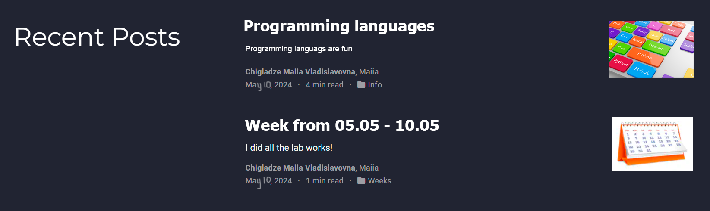

---
## Front matter
lang: ru-RU
title: Индивидуальный проект ч.5
subtitle: Добавить к сайту данные о себе.
author:
  - Чигладзе М.В.
institute:
  - Российский университет дружбы народов, Москва, Россия
date: 29 мая 2003

## i18n babel
babel-lang: russian
babel-otherlangs: english

## Formatting pdf
toc: false
toc-title: Содержание
slide_level: 2
aspectratio: 169
section-titles: true
theme: metropolis
header-includes:
 - \metroset{progressbar=frametitle,sectionpage=progressbar,numbering=fraction}
 - '\makeatletter'
 - '\beamer@ignorenonframefalse'
 - '\makeatother'
 ## Fonts
mainfont: PT Serif
romanfont: PT Serif
sansfont: PT Sans
monofont: PT Mono
mainfontoptions: Ligatures=TeX
romanfontoptions: Ligatures=TeX
sansfontoptions: Ligatures=TeX,Scale=MatchLowercase
monofontoptions: Scale=MatchLowercase,Scale=0.9
---

# Информация

## Докладчик

:::::::::::::: {.columns align=center}
::: {.column width="70%"}

  * Чигладзе Майя Владиславовна
  * студент РУДН направления Прикладная информатика
  * заместитель ОСК профсоюза РУДН
  * волонтер университета и Москвы
  * [1132239399@pfur.ru]
  * <https://github.com/LaMeru>

:::
::: {.column width="30%"}

:::
::::::::::::::

# Вводная часть

## Актуальность
 - В современном мире социальные сети и сайты стали неотъемлемой частью жизни многих людей. Они позволяют делиться информацией, общаться с друзьями и близкими, а также продвигать свои услуги или продукты. Однако, для того чтобы сайт был наиболее информативным и полезным, необходимо добавлять на него различные данные, в том числе и информацию о себе. Это позволяет пользователям лучше узнать владельца сайта и понять, чем он занимается. В данной лабораторной работе предлагается добавить к сайту указанные данные о себе, что будет способствовать повышению его информативности и актуальности.
 
## Объект и предмет исследования
 - Объект исследования: Веб-сайт
 - Предмет исследования: Процесс добавления данных о себе на веб-сайт

## Цели и задачи
 - Цель работы: Добавить к сайту данные о себе.

## Материалы и методы

Для выполнения данного этапа проекта будут использованы следующие материалы и методы:

 1. Изучение интерфейса административной панели сайта. 

 2. Загрузка файлов на сервер. 

 3. Создание новых разделов и страниц на сайте. 

 4. Настройка прав доступа к разделам и страницам. 

 5. Использование инструментов для работы с контентом (текстовым, графическим и т.д.).

# Выполнение лабораторной работы

# **Порядок выполнения индивидуальной работы**

# Задание 1

Сделала записи для персональных проектов.

## Задание 2

Сделать пост по прошедшей неделе.

{#fig:005 width=70%}

## Задание 3

Добавить пост на тему по выбору.

Языки научного программирования.

[2](image/2.png){#fig:005 width=70%}

## Результаты

Результаты на фото

{#fig:009 width=70%}

# **Выводы**

В ходе работы над индивидуальным проектом, я добавила к сайту данные о себе.

