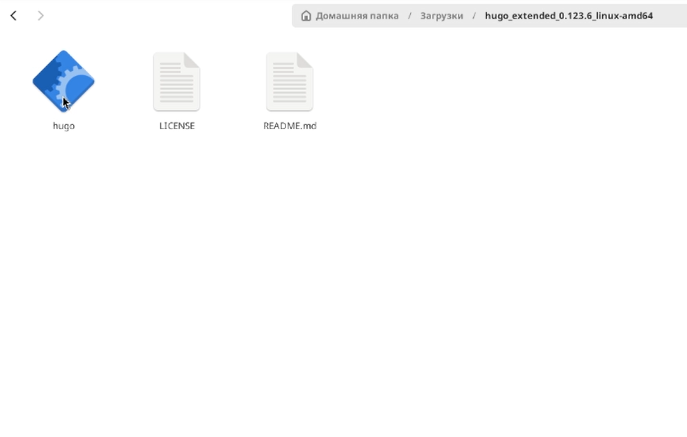
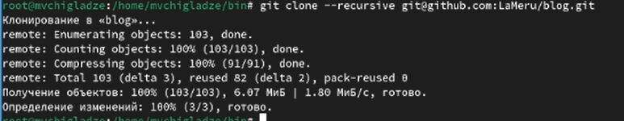
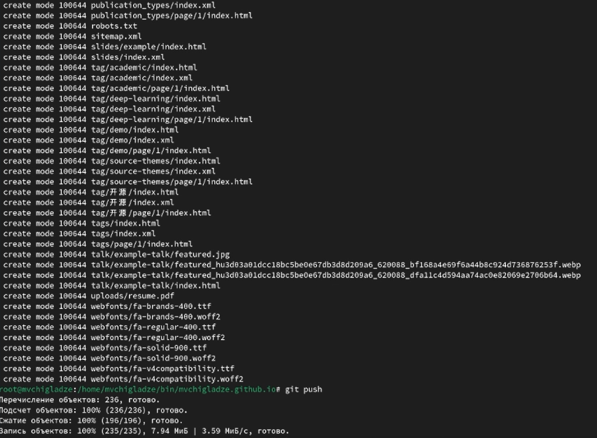
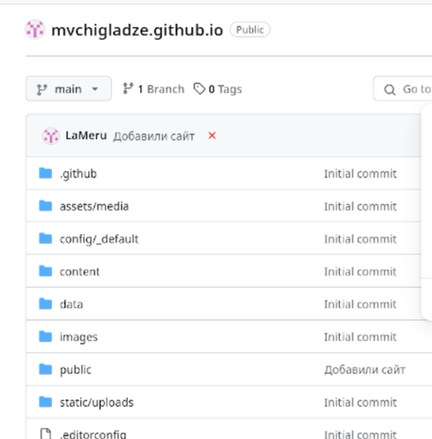
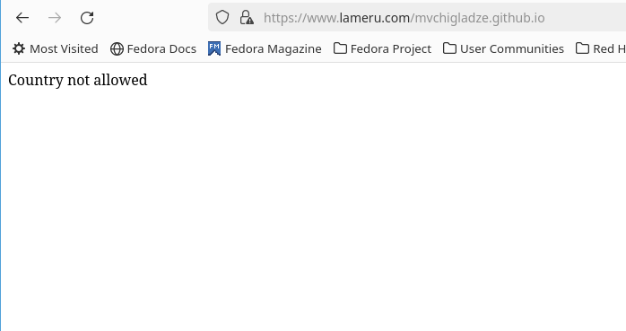

---
## Front matter
title: "Отчет по индивидуальному проекту ч.1"
subtitle: "Размещение на GitHub Pages заготовки для персонального сайта"
author: "Чигладзе Майя Владиславовна"

## Generic otions
lang: ru-RU
toc-title: "Содержание"

## Bibliography
bibliography: bib/cite.bib
csl: pandoc/csl/gost-r-7-0-5-2008-numeric.csl

## Pdf output format
toc: true # Table of contents
toc-depth: 2
lof: true # List of figures
lot: true # List of tables
fontsize: 12pt
linestretch: 1.5
papersize: a4
documentclass: scrreprt
## I18n polyglossia
polyglossia-lang:
  name: russian
  options:
    - spelling=modern
    - babelshorthands=true
polyglossia-otherlangs:
  name: english
## I18n babel
babel-lang: russian
babel-otherlangs: english
## Fonts
mainfont: PT Serif
romanfont: PT Serif
sansfont: PT Sans
monofont: PT Mono
mainfontoptions: Ligatures=TeX
romanfontoptions: Ligatures=TeX
sansfontoptions: Ligatures=TeX,Scale=MatchLowercase
monofontoptions: Scale=MatchLowercase,Scale=0.9
## Biblatex
biblatex: true
biblio-style: "gost-numeric"
biblatexoptions:
  - parentracker=true
  - backend=biber
  - hyperref=auto
  - language=auto
  - autolang=other*
  - citestyle=gost-numeric
## Pandoc-crossref LaTeX customization
figureTitle: "Рис."
tableTitle: "Таблица"
listingTitle: "Листинг"
lofTitle: "Список иллюстраций"
lotTitle: "Список таблиц"
lolTitle: "Листинги"
## Misc options
indent: true
header-includes:
  - \usepackage{indentfirst}
  - \usepackage{float} # keep figures where there are in the text
  - \floatplacement{figure}{H} # keep figures where there are in the text
---

# **Порядок выполнения индивидуальной работы**

## Задание 1

Установить необходимое программное обеспечение (рис. 1).
В данном случае это утилита hugo, которую я поместила в папку bin2

{#fig:001 width=70%}

## Задание 2

Скачать шаблон темы сайта (рис. 2)
Я скачала шаблон с данного мне преподавателем репозитория и клонировала в папку blog

{#fig:002 width=70%}

## Задание 3

Разместить его на хостинге git (рис. 3)
Я создала свой репозиторий, клонировала его в локальную папку с одноименным названием.
Перенесла туда файлы из папки blog и добавила, закомитила и спушила.

{#fig:003 width=70%}

## Задание 4

Установить параметр для URLs сайта. (рис. 4).

{#fig:004 width=70%}

## Задание 5

Разместить заготовку сайта на Github pages. (рис. 5).
Хотя у меня и были все нужные папки и файлы, гитхаб пейджес выдавал ошибку 404, а потом сказал, что в нашей стране это недоступо.

{#fig:005 width=70%}

# **Выводы**

В ходе работы над индивидуальным проектом, я привязала сайт к моему репозиторию гитхаб.

# Список литературы{.unnumbered}

::: {#refs}
:::

