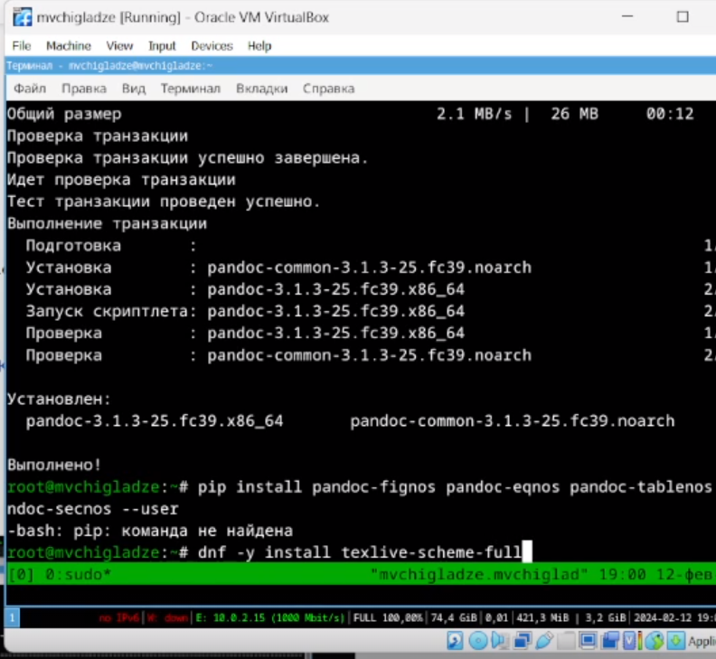

---
## Front matter
title: "Отчет по лабораторной работе №1"
subtitle: "Простейший вариант"
author: "Чигладзе Майя Владиславовна"

## Generic otions
lang: ru-RU
toc-title: "Содержание"

## Bibliography
bibliography: bib/cite.bib
csl: pandoc/csl/gost-r-7-0-5-2008-numeric.csl

## Pdf output format
toc: true # Table of contents
toc-depth: 2
lof: true # List of figures
lot: true # List of tables
fontsize: 12pt
linestretch: 1.5
papersize: a4
documentclass: scrreprt
## I18n polyglossia
polyglossia-lang:
  name: russian
  options:
    - spelling=modern
    - babelshorthands=true
polyglossia-otherlangs:
  name: english
## I18n babel
babel-lang: russian
babel-otherlangs: english
## Fonts
mainfont: PT Serif
romanfont: PT Serif
sansfont: PT Sans
monofont: PT Mono
mainfontoptions: Ligatures=TeX
romanfontoptions: Ligatures=TeX
sansfontoptions: Ligatures=TeX,Scale=MatchLowercase
monofontoptions: Scale=MatchLowercase,Scale=0.9
## Biblatex
biblatex: true
biblio-style: "gost-numeric"
biblatexoptions:
  - parentracker=true
  - backend=biber
  - hyperref=auto
  - language=auto
  - autolang=other*
  - citestyle=gost-numeric
## Pandoc-crossref LaTeX customization
figureTitle: "Рис."
tableTitle: "Таблица"
listingTitle: "Листинг"
lofTitle: "Список иллюстраций"
lotTitle: "Список таблиц"
lolTitle: "Листинги"
## Misc options
indent: true
header-includes:
  - \usepackage{indentfirst}
  - \usepackage{float} # keep figures where there are in the text
  - \floatplacement{figure}{H} # keep figures where there are in the text
---

# **Цель работы**

Целью данной работы является приобретение практических навыков установки операционной системы на виртуальную машину, настройки минимально необходимых для дальнейшей работы сервисов.

# **Порядок выполнения лабораторной работы**

## Задание 1

Вошла в ОС под заданной при установке учётной записью.Нажала комбинацию Win+Enter для запуска терминала.
Переключилась на роль супер-пользователя:

    sudo -i
    
Обновила все пакеты 

    dnf -y update (рис. \ref{@fig:001})

{#fig:001 width=70%}

## Задание 2. Повышение комфорта работы.

Программы для удобства работы в консоли:

    dnf -y install tmux mc (рис. [@fig:002])
    
{#fig:002 width=70%}

## Задание 3. Автоматическое обновление

Буду использовать автоматическое обновление.
Установила программное обеспечение:

    dnf install dnf-automatic

Задала необходимую конфигурацию в файле /etc/dnf/automatic.conf.
Запустила таймер :

    systemctl enable --now dnf-automatic.timer (рис. [@fig:003])
    
{#fig:003 width=70%}

## Задание 4. Отключение SELinux

Отключила систему безопасности SELinux.

    В файле /etc/selinux/config заменила значение

    SELINUX=enforcing

    на значение

    SELINUX=permissive

Перегрузила виртуальную машину:

    reboot (рис. [@fig:004])
    
{#fig:004 width=70%}

## Задание 5. Установка драйверов для VirtualBox

Вошла в ОС под заданной мной при установке учётной записью.
Нажала комбинацию Win+Enter для запуска терминала.
Запустила терминальный мультиплексор tmux:

    tmux

Переключилась на роль супер-пользователя:

    sudo -i

Установила средства разработки:

    dnf -y group install "Development Tools"

Установила пакет DKMS:

    dnf -y install dkms (рис. [@fig:005])
    
{#fig:005 width=70%}

В меню виртуальной машины подключила образ диска дополнений гостевой ОС.

Подмонтируйте диск:

    mount /dev/sr0 /media

Установите драйвера:

    /media/VBoxLinuxAdditions.run

Перегрузите виртуальную машину:

    reboot (рис. [@fig:006])
    
{#fig:006 width=70%}

## Задание 6. Настройка раскладки клавиатуры

Войшла в ОС под заданной при установке учётной записью.
Нажала комбинацию Win+Enter для запуска терминала.
Запустила терминальный мультиплексор tmux:

    tmux

Создала конфигурационный файл ~/.config/sway/config.d/95-system-keyboard-config.conf:

    touch ~/.config/sway/config.d/95-system-keyboard-config.conf

Отредактировала конфигурационный файл ~/.config/sway/config.d/95-system-keyboard-config.conf:

    exec_always /usr/libexec/sway-systemd/locale1-xkb-config --oneshot

Переключилась на роль супер-пользователя:

    sudo -i

Отредактировала конфигурационный файл /etc/X11/xorg.conf.d/00-keyboard.conf:

    Section "InputClass"
            Identifier "system-keyboard"
            MatchIsKeyboard "on"
            Option "XkbLayout" "us,ru"
            Option "XkbVariant" ",winkeys"
            Option "XkbOptions" "grp:rctrl_toggle,compose:ralt,terminate:ctrl_alt_bksp"
    EndSection

Для этого использовала файловый менеджер mc и его встроенный редактор.

Перегрузила виртуальную машину:

    reboot (рис. [@fig:007])
    
{#fig:007 width=70%}

## Задание 7. Работа с языком разметки Markdown

Средство pandoc для работы с языком разметки Markdown.
Установила с помощью менеджера пакетов:

    dnf -y install pandoc (рис. [@fig:008])
    
{#fig:008 width=70%}

## Задание 8. Tcexlive

Установим дистрибутив TeXlive:

    dnf -y install texlive-scheme-full (рис. [@fig:009])
    
{#fig:009 width=70%}

# **Домашнее задание**

Дождалась загрузки графического окружения и открыла терминал. 
В окне терминала проанализировала последовательность загрузки системы, выполнив команду dmesg. 
Просмотрела вывод этой команды:

    dmesg | less (рис. [@fig:010])
    
{#fig:010 width=70%}

Получила следующую информацию

    Версия ядра Linux (Linux version).
    Частота процессора (Detected Mhz processor).
    Модель процессора (CPU0).
    Объём доступной оперативной памяти (Memory available).
    Тип обнаруженного гипервизора (Hypervisor detected).
    Тип файловой системы корневого раздела.
    Последовательность монтирования файловых систем. [@fig:011])
    
{#fig:011 width=70%}

# **Контрольные вопросы**

## Лист вопросов

Какую информацию содержит учётная запись пользователя?

Укажите команды терминала и приведите примеры:
    для получения справки по команде;
    для перемещения по файловой системе;
    для просмотра содержимого каталога;
    для определения объёма каталога;
    для создания / удаления каталогов / файлов;
    для задания определённых прав на файл / каталог;
    для просмотра истории команд.

Что такое файловая система? Приведите примеры с краткой характеристикой.
Как посмотреть, какие файловые системы подмонтированы в ОС?
Как удалить зависший процесс?

## Лист ответов

1. 
Учётная запись пользователя – это запись, которая содержит сведения,
необходимые для идентификации пользователя при подключении к системе,
а также информацию для авторизации и учёта.

2.
man — manual, получение справки
cd — change directory, сменить директорию
ls — list, отобразить директории и файлы
du - для определения объема каталога
rm — remove, удаление
mkdir — создание директории
touch - создание файла
$ chmod - для изменения прав
history- для просмотра истории команд

3.
Файловая система — это способ хранить и организовывать информацию на каком-нибудь носителе.
FAT (File Allocation Table). Самый популярный вариант этой файловой системы — FAT32. Она довольно старая, сегодняшняя версия появилась еще в 90-х.
NTFS и ReFS (New Technology File System, Resilient File System). Файловые системы от компании Microsoft, которые по умолчанию используются для операционных систем Windows. Под управлением NTFS работают практически все версии Windows, кроме самых новых, где применяется более современная ReFS.

4.
Чтобы отобразить список смонтированных файловых систем, выполните в командной строке следующую команду - findmnt

5.
$ kill -сигнал pid_процесса

# **Выводы**

В ходе лабораторной работы, я приобрела практические навыки установки операционной системы на виртуальную машину, настройки минимально необходимых для дальнейшей работы сервисов.

# Список литературы{.unnumbered}

::: {#refs}
:::
