---
## Front matter
title: "Отчет по лабораторной работе №10"
subtitle: "Текстовой редактор vi"
author: "Чигладзе Майя Владиславовна"

## Generic otions
lang: ru-RU
toc-title: "Содержание"

## Bibliography
bibliography: bib/cite.bib
csl: pandoc/csl/gost-r-7-0-5-2008-numeric.csl

## Pdf output format
toc: true # Table of contents
toc-depth: 2
lof: true # List of figures
lot: true # List of tables
fontsize: 12pt
linestretch: 1.5
papersize: a4
documentclass: scrreprt
## I18n polyglossia
polyglossia-lang:
  name: russian
  options:
    - spelling=modern
    - babelshorthands=true
polyglossia-otherlangs:
  name: english
## I18n babel
babel-lang: russian
babel-otherlangs: english
## Fonts
mainfont: PT Serif
romanfont: PT Serif
sansfont: PT Sans
monofont: PT Mono
mainfontoptions: Ligatures=TeX
romanfontoptions: Ligatures=TeX
sansfontoptions: Ligatures=TeX,Scale=MatchLowercase
monofontoptions: Scale=MatchLowercase,Scale=0.9
## Biblatex
biblatex: true
biblio-style: "gost-numeric"
biblatexoptions:
  - parentracker=true
  - backend=biber
  - hyperref=auto
  - language=auto
  - autolang=other*
  - citestyle=gost-numeric
## Pandoc-crossref LaTeX customization
figureTitle: "Рис."
tableTitle: "Таблица"
listingTitle: "Листинг"
lofTitle: "Список иллюстраций"
lotTitle: "Список таблиц"
lolTitle: "Листинги"
## Misc options
indent: true
header-includes:
  - \usepackage{indentfirst}
  - \usepackage{float} # keep figures where there are in the text
  - \floatplacement{figure}{H} # keep figures where there are in the text
---

# **Цель работы**

Познакомиться с операционной системой Linux. Получить практические навыки работы с редактором vi, установленным по умолчанию практически во всех дистрибутивах

# **Порядок выполнения лабораторной работы**

## Задание 1.  Создание нового файла с использованием vi

1. Создала каталог с именем ~/work/os/lab06 

    mkdir (рис. 1).

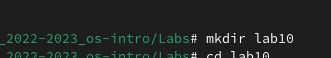{#fig:001 width=70%}

2. Перешла во вновь созданный каталог.

    cd (рис. 2).

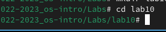{#fig:002 width=70%}

3. Вызвала vi и создала файл hello.sh
 
    vi hello.sh (рис. 3).

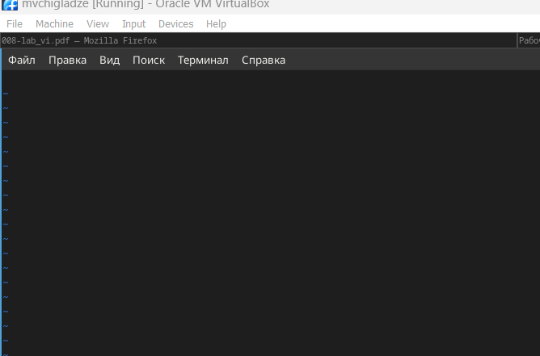{#fig:003 width=70%}

4. Нажала клавишу i и вводила текст (рис. 4).

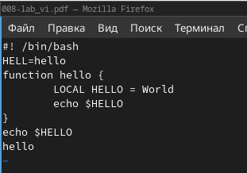{#fig:004 width=70%}

5. Нажала клавиши Esc для перехода в командный режим после завершения ввода
текста (рис. 5).

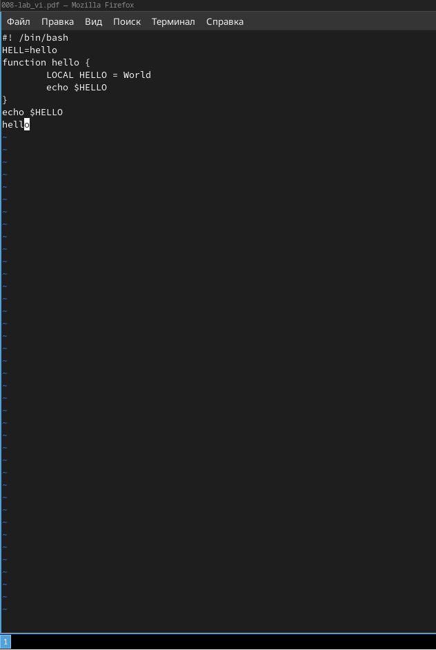{#fig:005 width=70%}

6. Нажала : для перехода в режим последней строки и внизу вашего экрана появилось
приглашение в виде двоеточия (рис. 6).

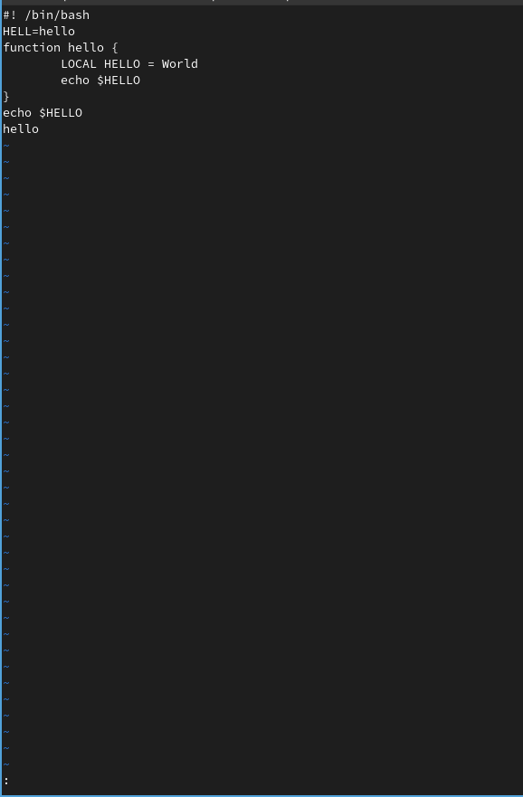{#fig:006 width=70%}

7. Нажала w (записать) и q (выйти), а затем нажала клавишу Enter для сохранения
моего текста и завершения работы (рис. 7).

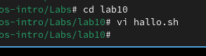{#fig:007 width=70%}

8. Сделала файл исполняемым

    chmod +x hello.sh (рис. 8).

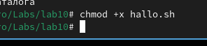{#fig:008 width=70%}

## Задание 2.   Редактирование существующего файла

1. Вызвала vi на редактирование файла

    vi ~/work/os/lab06/hello.sh (рис. 9).

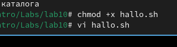{#fig:009 width=70%}

2. Установила курсор в конец слова HELL второй строки (рис. 10).

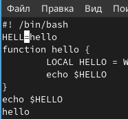{#fig:010 width=70%}

3. Перешла в режим вставки и заменила на HELLO. Нажмите Esc для возврата в командный режим.

    cw (рис. 11).

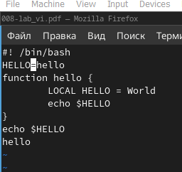{#fig:011 width=70%}

4. Установила курсор на четвертую строку и стерла слово LOCAL.

    dw  (рис. 12).

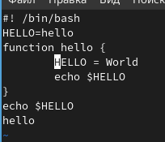{#fig:012 width=70%}

5. Перешла в режим вставки и набрала следующий текст: local, нажала Esc для возврата в командный режим. (рис. 13).

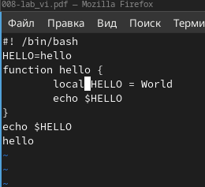{#fig:013 width=70%}

6. Установила курсор на последней строке файла. Вставила после неё строку, содержащую следующий текст: echo $HELLO.

    Y
    a (рис. 14).

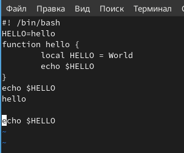{#fig:014 width=70%}

7. Нажала Esc для перехода в командный режим (рис. 15).

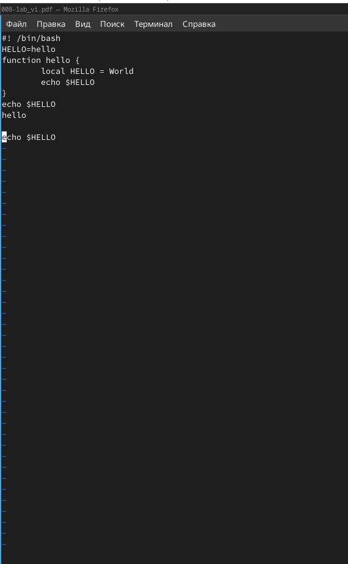{#fig:015 width=70%}

8. Удалила последнюю строку.

    dd (рис. 16).

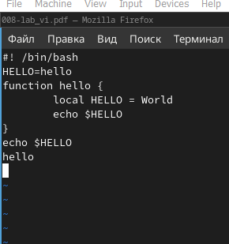{#fig:016 width=70%}

9. Ввела команду отмены изменений u для отмены последней команды (рис. 17).

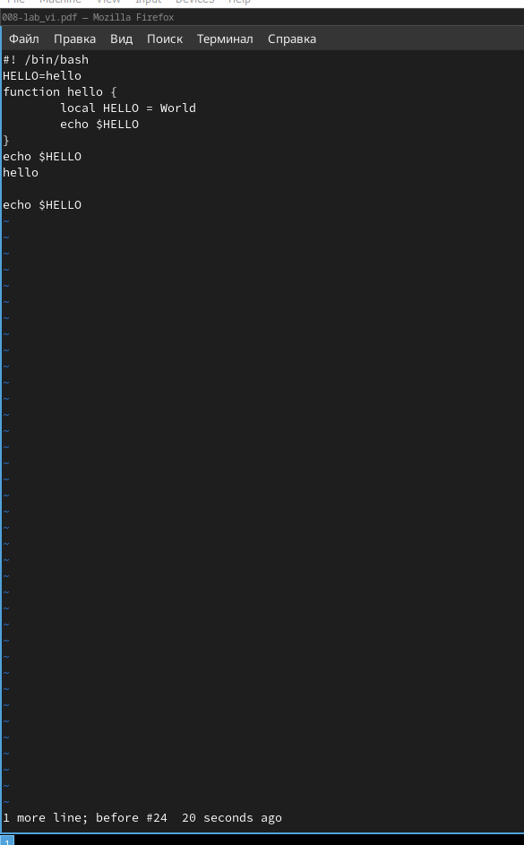{#fig:017 width=70%}

10. Ввела символ : для перехода в режим последней строки. Записала произведённые изменения и вышла из vi (рис. 18).

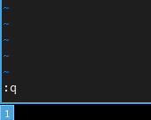{#fig:018 width=70%}

# Ответы на контрольные вопросы 

1. Режимы работы редактора Vi: вставка (Insert), командный (Command) и режим последней строки (Last Line).
2. Для выхода из редактора без сохранения изменений, находясь в командном режиме, нажмите “:q!”.
3. Команды позиционирования включают в себя перемещение курсора вверх/вниз, влево/вправо, а также перемещение на начало/конец строки или файла.
4. Слово в редакторе Vi - это последовательность символов, ограниченная с обеих сторон пробелами, табуляциями или знаками конца строки.
5. Для перехода в начало/конец файла из любой позиции используйте команды “gg” и “G”.
6. Основные группы команд редактирования: удаление символов, вставка и замена текста, перемещение по тексту.
7. Чтобы заполнить строку символами ,можно использовать команду":/$/gc" с последующим подтверждением изменений.
8. Для отмены последнего действия используйте команду “u”.
9. Основные группы команд режима последней строки: изменение содержимого последней строки, перемещение курсора в последнюю строку, удаление последней строки.
10. Определить позицию конца строки можно с помощью команды “:end” в командном режиме.
11. Опций редактора Vi более 100, узнать их назначение можно через справочную систему “:help опции”, доступ к которой осуществляется в командном режиме.
12. Режим работы редактора Vi можно определить по его приглашениям в командном и режиме вставки.
13. Граф взаимосвязи режимов работы Vi представляет собой иерархическую структуру, включающую три основных режима: командный, вставки и последней строки.

# **Выводы** 

В ходе лабораторной работы, я познакомилась с операционной системой Linux. Получила практические навыки работы с редактором vi, установленным по умолчанию практически во всех дистрибутивах

# Список литературы{.unnumbered}

::: {#refs}
:::

