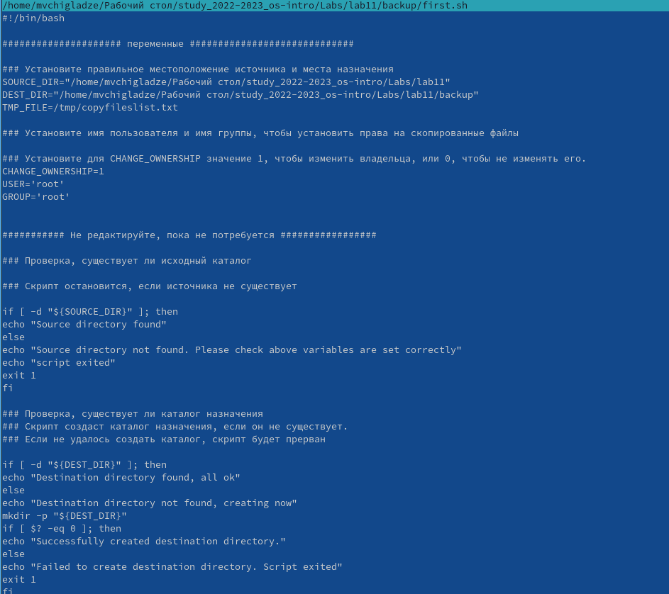
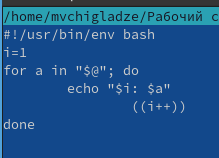
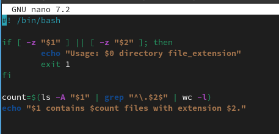

---
## Front matter
lang: ru-RU
title: Лабораторная работа 11
subtitle: Программирование в командном процессоре ОС UNIX. Командные файлы
author:
  - Чигладзе М.В.
institute:
  - Российский университет дружбы народов, Москва, Россия
date: 29 мая 2003

## i18n babel
babel-lang: russian
babel-otherlangs: english

## Formatting pdf
toc: false
toc-title: Содержание
slide_level: 2
aspectratio: 169
section-titles: true
theme: metropolis
header-includes:
 - \metroset{progressbar=frametitle,sectionpage=progressbar,numbering=fraction}
 - '\makeatletter'
 - '\beamer@ignorenonframefalse'
 - '\makeatother'
 ## Fonts
mainfont: PT Serif
romanfont: PT Serif
sansfont: PT Sans
monofont: PT Mono
mainfontoptions: Ligatures=TeX
romanfontoptions: Ligatures=TeX
sansfontoptions: Ligatures=TeX,Scale=MatchLowercase
monofontoptions: Scale=MatchLowercase,Scale=0.9
---

# Информация

## Докладчик

:::::::::::::: {.columns align=center}
::: {.column width="70%"}

  * Чигладзе Майя Владиславовна
  * студентка РУДН направления Прикладная информатика
  * заместитель ОСК профсоюза РУДН
  * волонтер университета и Москвы
  * [1132239399@pfur.ru]
  * <https://github.com/LaMeru>

:::
::: {.column width="30%"}

:::
::::::::::::::

# Вводная часть

## Актуальность
 -  Программирование в командной оболочке ОС UNIX является актуальной темой, поскольку командная оболочка является основным инструментом взаимодействия пользователя с операционной системой.

## Объект и предмет исследования
 - Объект исследования:  Командные файлы и язык программирования Bash
 - Предмет исследования: Возможности и особенности программирования в командной оболочке UNIX.

## Цели и задачи
Цель работы: Изучение возможностей и особенностей программирования в командной оболочке UNIX, а также получение практических навыков работы с командными файлами
Задачи работы:
 - Изучение основ языка программирования Bash;
 - Разработка простых и сложных командных файлов;
 - Использование переменных, циклов и условных операторов в командных файлах;
 - Работа с ошибками и отладка командных файлов;
 - Применение функций и переменных для упрощения и структурирования кода.
 
## Материалы и методы

 Анализ литературы, изучение документации, написание и тестирование командных файлов
 
# Выполнение лабораторной работы

## Задание 1.  

Задача: Написать скрипт, который при запуске будет делать резервную копию самого себя (то
есть файла, в котором содержится его исходный код) в другую директорию backup
в вашем домашнем каталоге. При этом файл должен архивироваться одним из архиваторов на выбор zip, bzip2 или tar. Способ использования команд архивации
необходимо узнать, изучив справку.

## Код. 

{#fig:001 width=70%}

## Результат 

{#fig:002 width=70%}

{#fig:003 width=70%}

## Задание 2.  

Задача: Написать пример командного файла, обрабатывающего любое произвольное число
аргументов командной строки, в том числе превышающее десять. Например, скрипт
может последовательно распечатывать значения всех переданных аргументов

## Код

{#fig:004 width=70%}

## Результат

{#fig:005 width=70%}

## Задание 3.  

Задача: Написать командный файл — аналог команды ls (без использования самой этой команды и команды dir). Требуется, чтобы он выдавал информацию о нужном каталоге
и выводил информацию о возможностях доступа к файлам этого каталога.

## Код

{#fig:006 width=70%}

## Результат

{#fig:007 width=70%}

## Задание 4.  

Задача: Написать командный файл, который получает в качестве аргумента командной строки
формат файла (.txt, .doc, .jpg, .pdf и т.д.) и вычисляет количество таких файлов
в указанной директории. Путь к директории также передаётся в виде аргумента командной строки

## Код

{#fig:008 width=70%}

## Результат

{#fig:009 width=70%}

# Результаты

В результате данной работы я изучила возможности и особенностей программирования в командной оболочке UNIX, а также получила практические навыки работы с командными файлами
