---
## Front matter
title: "Отчет по лабораторной работе №11"
subtitle: "Текстовой редактор emacs"
author: "Чигладзе Майя Владиславовна"

## Generic otions
lang: ru-RU
toc-title: "Содержание"

## Bibliography
bibliography: bib/cite.bib
csl: pandoc/csl/gost-r-7-0-5-2008-numeric.csl

## Pdf output format
toc: true # Table of contents
toc-depth: 2
lof: true # List of figures
lot: true # List of tables
fontsize: 12pt
linestretch: 1.5
papersize: a4
documentclass: scrreprt
## I18n polyglossia
polyglossia-lang:
  name: russian
  options:
    - spelling=modern
    - babelshorthands=true
polyglossia-otherlangs:
  name: english
## I18n babel
babel-lang: russian
babel-otherlangs: english
## Fonts
mainfont: PT Serif
romanfont: PT Serif
sansfont: PT Sans
monofont: PT Mono
mainfontoptions: Ligatures=TeX
romanfontoptions: Ligatures=TeX
sansfontoptions: Ligatures=TeX,Scale=MatchLowercase
monofontoptions: Scale=MatchLowercase,Scale=0.9
## Biblatex
biblatex: true
biblio-style: "gost-numeric"
biblatexoptions:
  - parentracker=true
  - backend=biber
  - hyperref=auto
  - language=auto
  - autolang=other*
  - citestyle=gost-numeric
## Pandoc-crossref LaTeX customization
figureTitle: "Рис."
tableTitle: "Таблица"
listingTitle: "Листинг"
lofTitle: "Список иллюстраций"
lotTitle: "Список таблиц"
lolTitle: "Листинги"
## Misc options
indent: true
header-includes:
  - \usepackage{indentfirst}
  - \usepackage{float} # keep figures where there are in the text
  - \floatplacement{figure}{H} # keep figures where there are in the text
---

# **Цель работы**

Познакомиться с операционной системой Linux. Получить практические навыки работы с редактором Emacs.

# **Порядок выполнения лабораторной работы**

## Задание 1. Открыла emacs 

Результат (рис. 1).

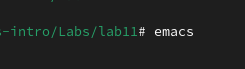{#fig:001 width=70%}

## Задание 2. Cоздала файл lab07.sh с помощью комбинации Ctrl-x Ctrl-f (C-x C-f).

Результат (рис. 2).

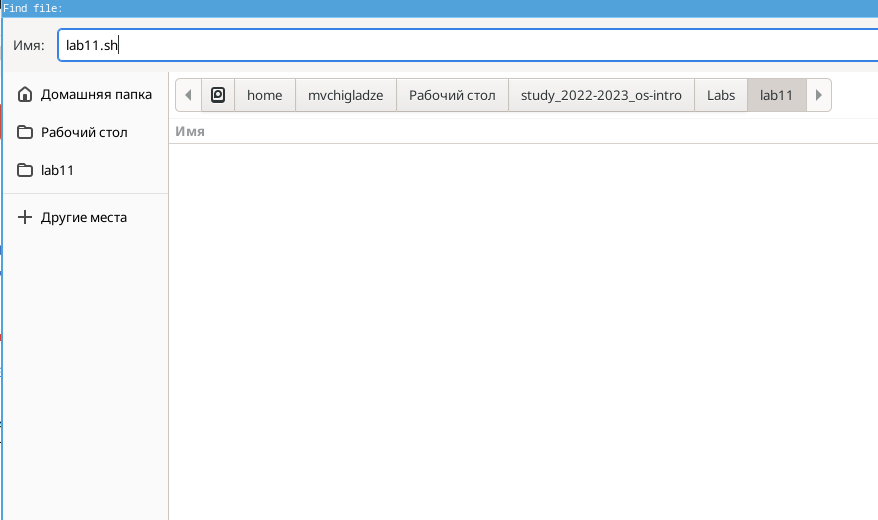{#fig:002 width=70%}

## Задание 3. Набрала текст

Результат (рис. 3).

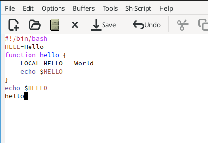{#fig:003 width=70%}

## Задание 4. Сохранила файл с помощью комбинации Ctrl-x Ctrl-s (C-x C-s)

Результат (рис. 4).

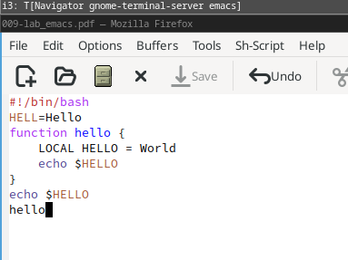{#fig:004 width=70%}

## Задание 5. Проделала с текстом стандартные процедуры редактирования.

1. Вырезала одной командой целую строку (С-k) (рис. 5).

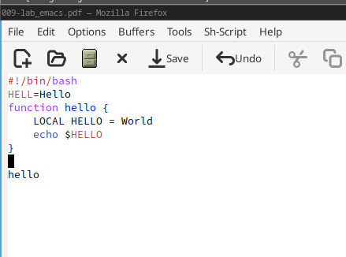{#fig:005 width=70%}

2. Вставила эту строку в конец файла (C-y)(рис. 6).

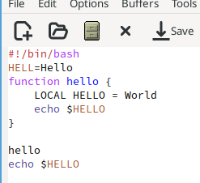{#fig:006 width=70%}

3. Выделила область текста (C-space) (рис. 7).

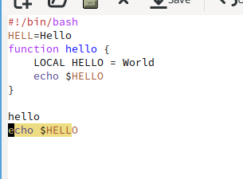{#fig:007 width=70%}

4. Скопировала область в буфер обмена (M-w)(рис. 8).

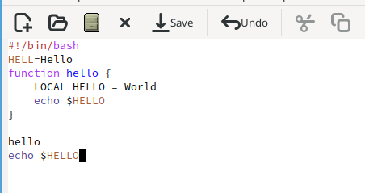{#fig:008 width=70%}

5. Вставила область в конец файла (рис. 9).

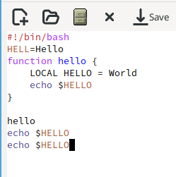{#fig:009 width=70%}

6. Вновь выделила эту область и на этот раз вырезала её (C-w) (рис. 10).

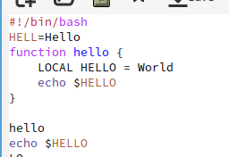{#fig:010 width=70%}

7. Отменила последнее действие (C-/) (рис. 11).

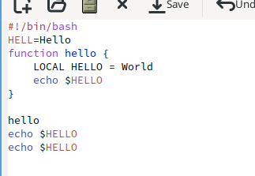{#fig:011 width=70%}

## Задание 6. Научилась использовать команды по перемещению курсора.

1. Переместила курсор в начало строки (C-a) (рис. 12).

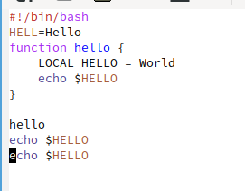{#fig:012 width=70%}

2. Переместила курсор в конец строки (C-e) (рис. 13).

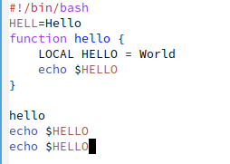{#fig:013 width=70%}

3. Переместила курсор в начало буфера (M-<) (рис. 14).

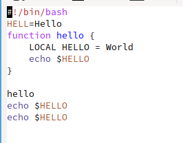{#fig:014 width=70%}

4. Переместила курсор в конец буфера (M->)(рис. 15).

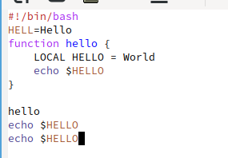{#fig:015 width=70%}

## Задание 7. Управление буферами

1. Вывела список активных буферов на экран (C-x C-b)(рис. 16).

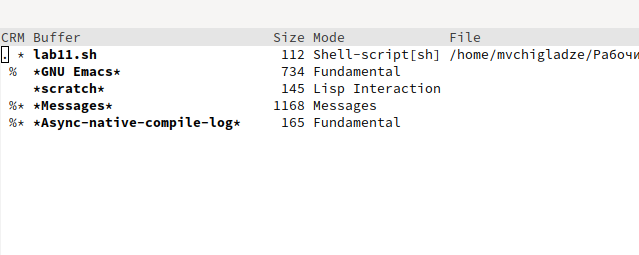{#fig:016 width=70%}

2. Переместила во вновь открытое окно (C-x) o со списком открытых буферов и переключилась на другой буфер (рис. 17).

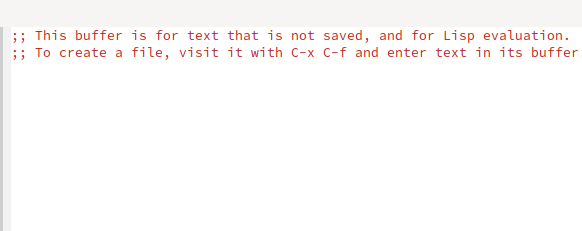{#fig:017 width=70%}

3. Закрыла это окно (C-x 0) (рис. 18).

{#fig:018 width=70%}

4. Теперь вновь переключилась между буферами, но уже без вывода их списка на экран (C-x b) (рис. 19).

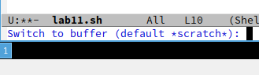{#fig:019 width=70%}

## Задание 8. Управление окнами.

1. Поделите фрейм на 4 части: разделите фрейм на два окна по вертикали (C-x 3)
а затем каждое из этих окон на две части по горизонтали (C-x 2)  (рис. 20).

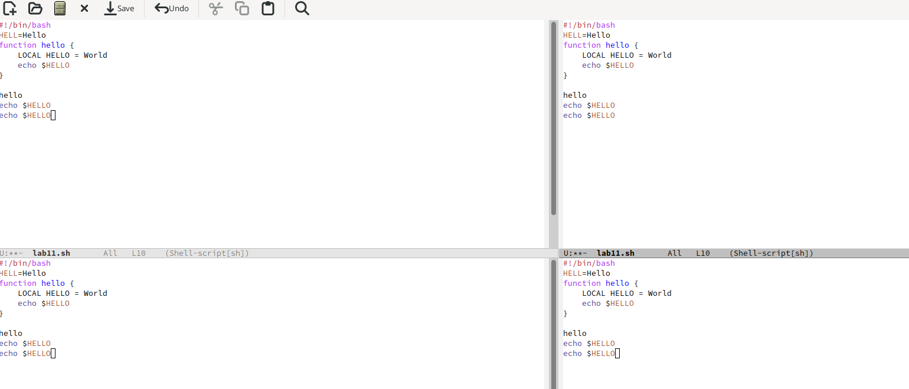{#fig:020 width=70%}

2. В каждом из четырёх созданных окон откройте новый буфер (файл) и введите
несколько строк текста (рис. 21).

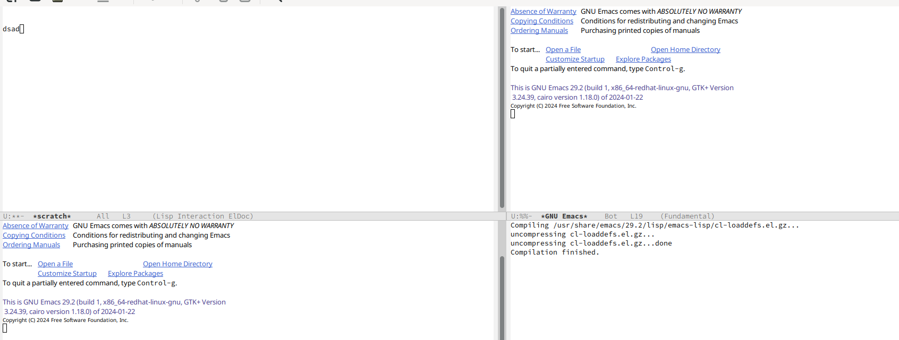{#fig:021 width=70%}

## Задание 9. Режим поиска

1. Переключилась в режим поиска (C-s) и нашла несколько слов, присутствующих в тексте рис. 22).

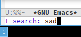{#fig:022 width=70%}

2. Переключилась между результатами поиска, нажимая C-s (рис. 23).

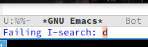{#fig:023 width=70%}

3. Вышла из режима поиска, нажав C-g (рис. 24).

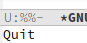{#fig:024 width=70%}

4. Перешла в режим поиска и замены (M-%), ввела текст, который следует найти
и заменить, нажмите Enter , затем ввела текст для замены. После того как будут
подсвечены результаты поиска, нажмите ! для подтверждения замены. (рис. 25).

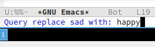{#fig:025 width=70%}

5. Испробовала другой режим поиска, нажав M-s o. Он отличается тем, что ищет по всем буферам и окнам. (рис. 26).

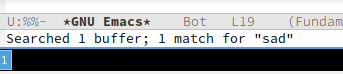{#fig:026 width=70%}

# Ответы на контрольные вопросы 

1. Emacs - это текстовый редактор, написанный на языке Emacs Lisp, который предлагает многофункциональность и гибкость. Он имеет встроенный интерпретатор, поддерживает множество языков программирования и может быть расширен с помощью пользовательских пакетов.
2. Особенности редактора Emacs, которые могут сделать его сложным: обилие горячих клавиш, отсутствие интерфейса с графическим меню, необходимость знания языка Emacs Lisp для глубокой настройки.
3. Буфер в терминологии Emacs – это файл, с которым в данный момент работает редактор. Окно – это область на экране, в которой отображается содержимое буфера.
4. Да, можно открыть более 10 буферов в одном окне, используя различные режимы просмотра.
5. При запуске Emacs по умолчанию создаются буферы для инициализации основных систем редактора, включая режим загрузки файла, окно сообщений и командную строку.
6. Для ввода комбинации C-c | (Control-c вертикальное разделение) и C-c C- (Control-c удаление) необходимо нажать клавиши Ctrl, c, и затем соответствующую клавишу (вертикальное разделение или удаление).
7. Чтобы разделить текущее окно Emacs на две части, используйте комбинацию C-x 2 (Control-x два), которая вставляет горизонтальный разделитель в текущую позицию курсора.
8. Настройки редактора Emacs хранятся в файле .emacs.d/init.el в домашнем каталоге пользователя.
9. Клавиша ` обычно используется для изменения регистра символов и не может быть переназначена.
10. Я предпочитаю Emacs из-за его гибкости и возможности настройки под свои нужды. Однако, если вы только начинаете изучать редактирование текста, Emacs может показаться сложным из-за обилия горячих клавиш и отсутствия графического меню. В этом случае, редактор vi может быть более подходящим вариантом.

# **Выводы** 

В ходе лабораторной работы, я познакомилась с операционной системой Linux. Получила практические навыки работы с редактором Emacs.

# Список литературы{.unnumbered}

::: {#refs}
:::

