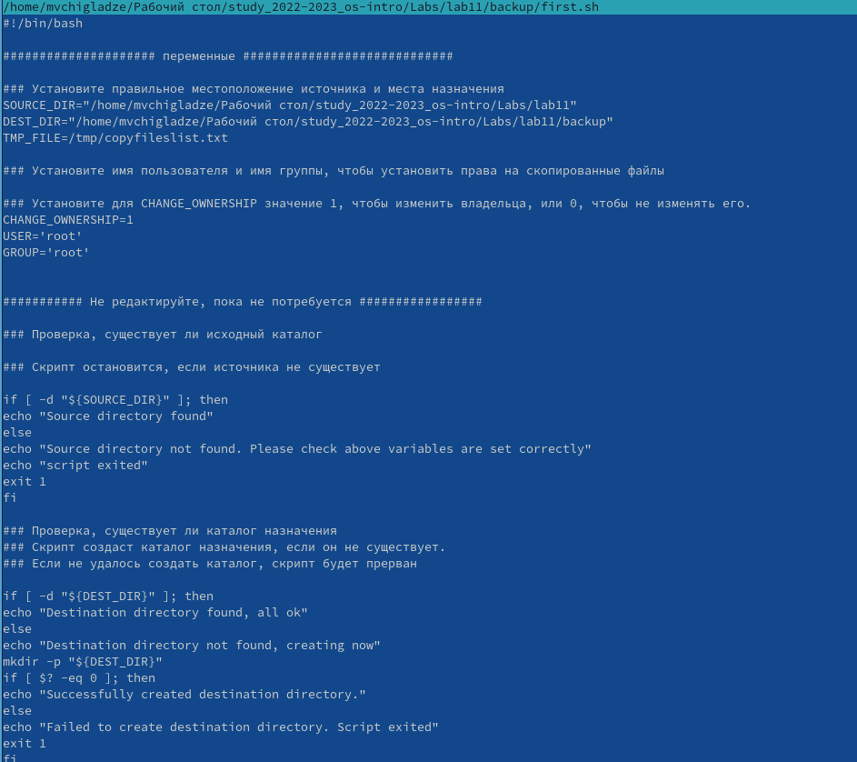
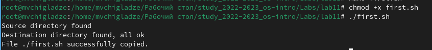
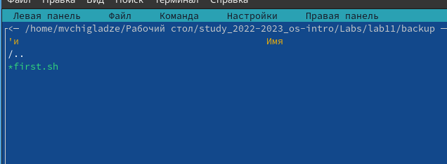
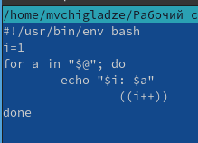
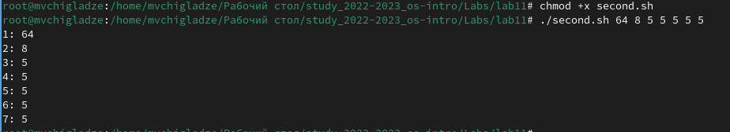
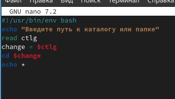
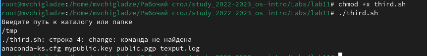
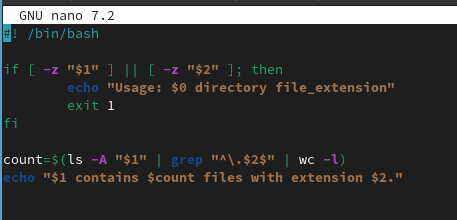
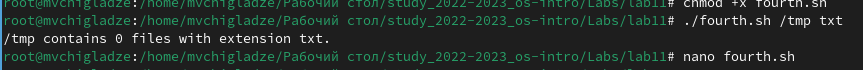

---
## Front matter
title: "Отчет по лабораторной работе №12"
subtitle: "Программирование в командном процессоре ОС UNIX. Командные файлы"
author: "Чигладзе Майя Владиславовна"

## Generic otions
lang: ru-RU
toc-title: "Содержание"

## Bibliography
bibliography: bib/cite.bib
csl: pandoc/csl/gost-r-7-0-5-2008-numeric.csl

## Pdf output format
toc: true # Table of contents
toc-depth: 2
lof: true # List of figures
lot: true # List of tables
fontsize: 12pt
linestretch: 1.5
papersize: a4
documentclass: scrreprt
## I18n polyglossia
polyglossia-lang:
  name: russian
  options:
    - spelling=modern
    - babelshorthands=true
polyglossia-otherlangs:
  name: english
## I18n babel
babel-lang: russian
babel-otherlangs: english
## Fonts
mainfont: PT Serif
romanfont: PT Serif
sansfont: PT Sans
monofont: PT Mono
mainfontoptions: Ligatures=TeX
romanfontoptions: Ligatures=TeX
sansfontoptions: Ligatures=TeX,Scale=MatchLowercase
monofontoptions: Scale=MatchLowercase,Scale=0.9
## Biblatex
biblatex: true
biblio-style: "gost-numeric"
biblatexoptions:
  - parentracker=true
  - backend=biber
  - hyperref=auto
  - language=auto
  - autolang=other*
  - citestyle=gost-numeric
## Pandoc-crossref LaTeX customization
figureTitle: "Рис."
tableTitle: "Таблица"
listingTitle: "Листинг"
lofTitle: "Список иллюстраций"
lotTitle: "Список таблиц"
lolTitle: "Листинги"
## Misc options
indent: true
header-includes:
  - \usepackage{indentfirst}
  - \usepackage{float} # keep figures where there are in the text
  - \floatplacement{figure}{H} # keep figures where there are in the text
---

# **Цель работы**

Изучить основы программирования в оболочке ОС UNIX/Linux. Научиться писать небольшие командные файлы

# **Порядок выполнения лабораторной работы**

## Задание 1.  

Задача: Написать скрипт, который при запуске будет делать резервную копию самого себя (то
есть файла, в котором содержится его исходный код) в другую директорию backup
в вашем домашнем каталоге. При этом файл должен архивироваться одним из архиваторов на выбор zip, bzip2 или tar. Способ использования команд архивации
необходимо узнать, изучив справку.

1. Код/файл (рис. 1).

{#fig:001 width=70%}

2. Результат (рис. 2).

{#fig:002 width=70%}

3. Результат (рис. 3).

{#fig:003 width=70%}

## Задание 2.  

Задача: Написать пример командного файла, обрабатывающего любое произвольное число
аргументов командной строки, в том числе превышающее десять. Например, скрипт
может последовательно распечатывать значения всех переданных аргументов

1. Код/файл (рис. 4).

{#fig:004 width=70%}

2. Результат (рис. 5).

{#fig:005 width=70%}

## Задание 3.  

Задача: Написать командный файл — аналог команды ls (без использования самой этой команды и команды dir). Требуется, чтобы он выдавал информацию о нужном каталоге
и выводил информацию о возможностях доступа к файлам этого каталога.

1. Код/файл (рис. 6).

{#fig:006 width=70%}

2. Результат (рис. 7).

{#fig:007 width=70%}

## Задание 4.  

Задача: Написать командный файл, который получает в качестве аргумента командной строки
формат файла (.txt, .doc, .jpg, .pdf и т.д.) и вычисляет количество таких файлов
в указанной директории. Путь к директории также передаётся в виде аргумента командной строки

1. Код/файл (рис. 8).

{#fig:008 width=70%}

2. Результат (рис. 9).

{#fig:009 width=70%}

# Ответы на контрольные вопросы 

1. Командная оболочка - это программа, которая обеспечивает интерфейс между пользователем и операционной системой. Она принимает команды от пользователя и передает их на выполнение операционной системе. Примеры командных оболочек включают в себя Bash, Zsh, Fish и PowerShell. Они отличаются синтаксисом команд, возможностями настройки и поддержкой дополнительных функций.
2. POSIX (Portable Operating System Interface) - это стандарт, определяющий интерфейс между операционной системой и приложениями. Он описывает, как приложения должны взаимодействовать с операционной системой для обеспечения переносимости кода между различными платформами.
3. Переменные и массивы определяются с помощью символов доллара ($), знака равенства (=) и имени переменной. Массивы создаются с использованием квадратных скобок ([]).
4. Оператор let используется для выполнения арифметических операций и присвоения значений переменным. Оператор read считывает ввод пользователя.
5. Арифметические операции включают сложение (+), вычитание (-), умножение (*) и деление (/).
6. Операция (( )) используется для вычисления арифметических выражений.
7. Стандартные имена переменных включают $PWD (текущий рабочий каталог), $RANDOM (случайное число), $? (код возврата последней команды) и $PATH (путь поиска для исполняемых файлов).
8. Метасимволы - это символы, имеющие специальное значение в контексте регулярных выражений или командных строк.
9. Для экранирования метасимволов необходимо использовать обратный слэш (\).
10. Командные файлы создаются с помощью текстового редактора и сохраняются с расширением .sh. Для запуска командного файла нужно выполнить его в командной строке.
11. Функции определяются с использованием ключевого слова function, за которым следует имя функции и список параметров.
12. Команда “ls -la” может использоваться для определения типа файла (обычный файл или каталог).
13. Команды set, typeset и unset используются для определения, изменения и удаления переменных соответственно.
14. Параметры передаются в командной строке через разделитель (обычно пробел).
15. Специальные переменные включают $*, $?, $!, $@ и $#.

# **Выводы** 

В ходе лабораторной работы, я изучила основы программирования в оболочке ОС UNIX/Linux. Научилась писать небольшие командные файлы

# Список литературы{.unnumbered}

::: {#refs}
:::

