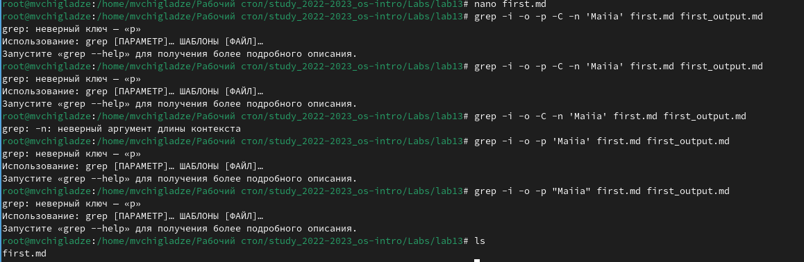
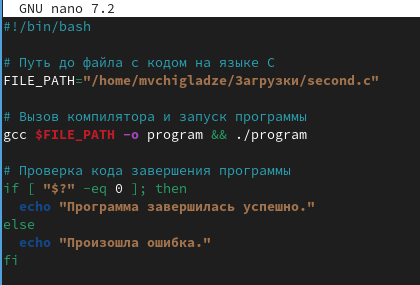
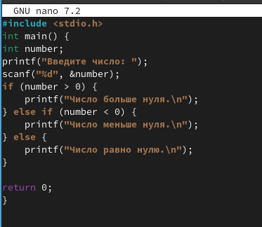
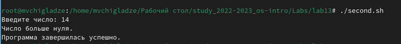
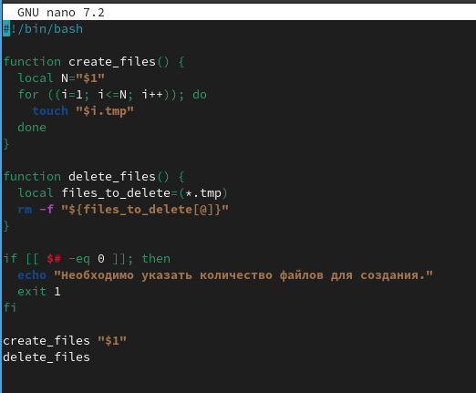
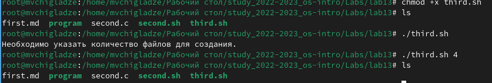
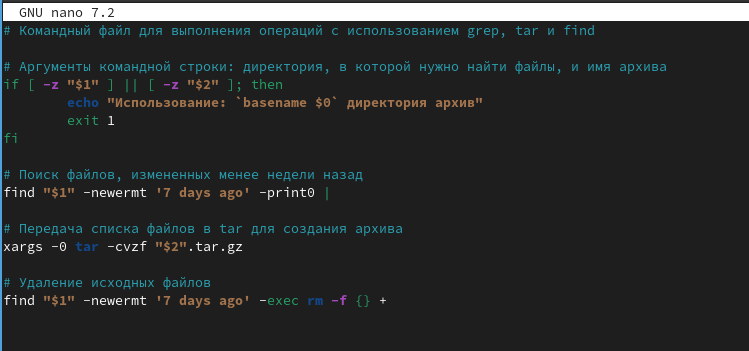
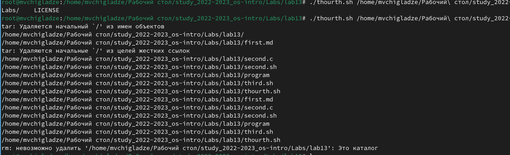

---
## Front matter
lang: ru-RU
title: Лабораторная работа 13
subtitle: Программирование в командном процессоре ОС UNIX. Ветвления и циклы
author:
  - Чигладзе М.В.
institute:
  - Российский университет дружбы народов, Москва, Россия
date: 29 мая 2003

## i18n babel
babel-lang: russian
babel-otherlangs: english

## Formatting pdf
toc: false
toc-title: Содержание
slide_level: 2
aspectratio: 169
section-titles: true
theme: metropolis
header-includes:
 - \metroset{progressbar=frametitle,sectionpage=progressbar,numbering=fraction}
 - '\makeatletter'
 - '\beamer@ignorenonframefalse'
 - '\makeatother'
 ## Fonts
mainfont: PT Serif
romanfont: PT Serif
sansfont: PT Sans
monofont: PT Mono
mainfontoptions: Ligatures=TeX
romanfontoptions: Ligatures=TeX
sansfontoptions: Ligatures=TeX,Scale=MatchLowercase
monofontoptions: Scale=MatchLowercase,Scale=0.9
---

# Информация

## Докладчик

:::::::::::::: {.columns align=center}
::: {.column width="70%"}

  * Чигладзе Майя Владиславовна
  * студентка РУДН направления Прикладная информатика
  * заместитель ОСК профсоюза РУДН
  * волонтер университета и Москвы
  * [1132239399@pfur.ru]
  * <https://github.com/LaMeru>

:::
::: {.column width="30%"}

:::
::::::::::::::

# Вводная часть

## Актуальность
 -   Актуальна для студентов, изучающих операционные системы и программирование в контексте Unix-систем.

## Объект и предмет исследования
 - Объект исследования:  Командный процессор операционной системы UNIX, его синтаксис и возможности.
 - Предмет исследования: Написание и выполнение командных файлов на языке UNIX Shell.

## Цели и задачи
Цель работы: Изучить основы программирования в оболочке ОС UNIX. Научится писать более сложные командные файлы с использованием логических управляющих конструкций
и циклов

Задачи работы:

 - Изучение возможностей и синтаксиса командного процессора UNIX
 - Освоение основных операторов и конструкций языка UNIX Shell
 - Изучение методов обработки аргументов и опций
 - Освоение операторов ветвления и циклов 
 - Изучение возможностей управления ошибками и выхода из программ
 - Разработка и выполнение лабораторных заданий.
 
## Материалы и методы

Методы исследования включают изучение документации и примеров использования командного процессора, написание и тестирование командных файлов, анализ результатов выполнения команд.
 
# Выполнение лабораторной работы

## Задание 1.  

Задача: Используя команды getopts grep, написать командный файл, который анализирует
командную строку с ключами:
– -iinputfile — прочитать данные из указанного файла;
– -ooutputfile — вывести данные в указанный файл;
– -pшаблон — указать шаблон для поиска;
– -C — различать большие и малые буквы;
– -n — выдавать номера строк.

## Код. 

{#fig:001 width=70%}

## Задание 2.  

Задача: Написать на языке Си программу, которая вводит число и определяет, является ли оно
больше нуля, меньше нуля или равно нулю. Затем программа завершается с помощью
функции exit(n), передавая информацию в о коде завершения в оболочку. Команд-
ный файл должен вызывать эту программу и, проанализировав с помощью команды
$?, выдать сообщение о том, какое число было введено.

## Код

{#fig:002 width=70%}

## Код

{#fig:003 width=70%}

## Результат

{#fig:004 width=70%}

## Задание 3.  

Задача: Написать командный файл, создающий указанное число файлов, пронумерованных
последовательно от 1 до 𝑁 (например 1.tmp, 2.tmp, 3.tmp,4.tmp и т.д.). Число файлов,
которые необходимо создать, передаётся в аргументы командной строки. Этот же ко-
мандный файл должен уметь удалять все созданные им файлы (если они существуют).

## Код

{#fig:005 width=70%}

## Результат

{#fig:006 width=70%}

## Задание 4.  

Задача: Написать командный файл, который с помощью команды tar запаковывает в архив
все файлы в указанной директории. Модифицировать его так, чтобы запаковывались
только те файлы, которые были изменены менее недели тому назад (использовать
команду find).

## Код

{#fig:007 width=70%}

## Результат

{#fig:008 width=70%}

# Результаты

В результате данной работы я изучила основы программирования в оболочке ОС UNIX. Научилась писать более сложные командные файлы с использованием логических управляющих конструкций и циклов.
