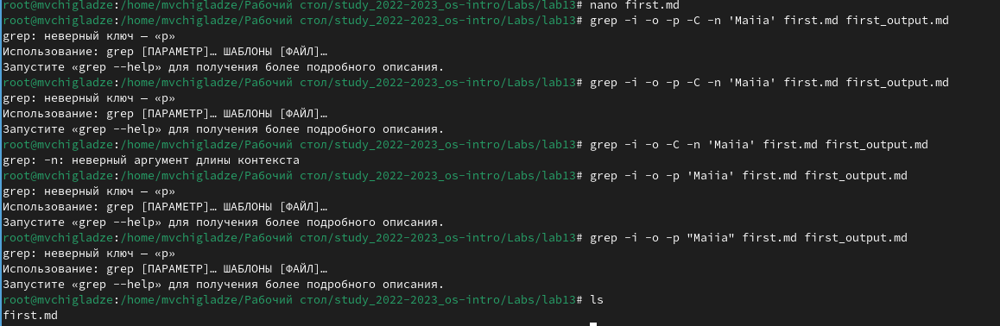
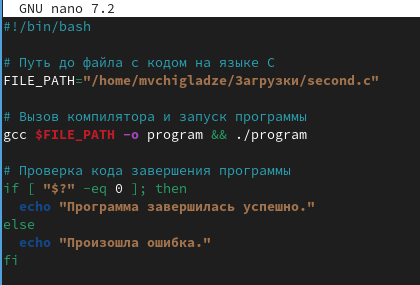
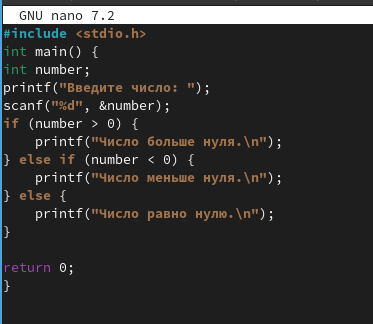
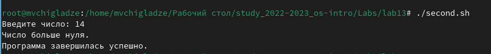
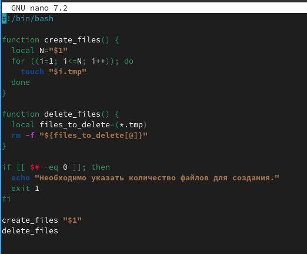
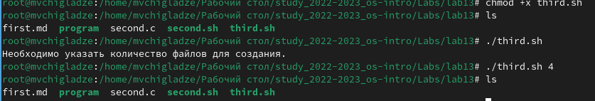
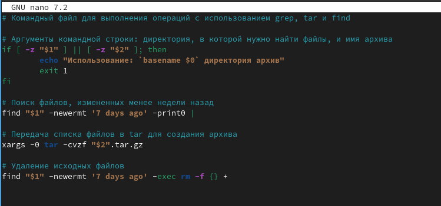
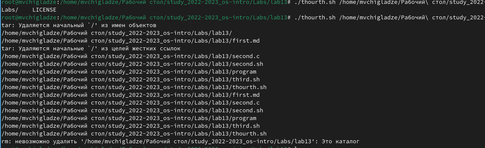

---
## Front matter
title: "Отчет по лабораторной работе №13"
subtitle: "Программирование в командном процессоре ОС UNIX. Командные файлы"
author: "Чигладзе Майя Владиславовна"

## Generic otions
lang: ru-RU
toc-title: "Содержание"

## Bibliography
bibliography: bib/cite.bib
csl: pandoc/csl/gost-r-7-0-5-2008-numeric.csl

## Pdf output format
toc: true # Table of contents
toc-depth: 2
lof: true # List of figures
lot: true # List of tables
fontsize: 12pt
linestretch: 1.5
papersize: a4
documentclass: scrreprt
## I18n polyglossia
polyglossia-lang:
  name: russian
  options:
    - spelling=modern
    - babelshorthands=true
polyglossia-otherlangs:
  name: english
## I18n babel
babel-lang: russian
babel-otherlangs: english
## Fonts
mainfont: PT Serif
romanfont: PT Serif
sansfont: PT Sans
monofont: PT Mono
mainfontoptions: Ligatures=TeX
romanfontoptions: Ligatures=TeX
sansfontoptions: Ligatures=TeX,Scale=MatchLowercase
monofontoptions: Scale=MatchLowercase,Scale=0.9
## Biblatex
biblatex: true
biblio-style: "gost-numeric"
biblatexoptions:
  - parentracker=true
  - backend=biber
  - hyperref=auto
  - language=auto
  - autolang=other*
  - citestyle=gost-numeric
## Pandoc-crossref LaTeX customization
figureTitle: "Рис."
tableTitle: "Таблица"
listingTitle: "Листинг"
lofTitle: "Список иллюстраций"
lotTitle: "Список таблиц"
lolTitle: "Листинги"
## Misc options
indent: true
header-includes:
  - \usepackage{indentfirst}
  - \usepackage{float} # keep figures where there are in the text
  - \floatplacement{figure}{H} # keep figures where there are in the text
---

# **Цель работы**

Изучить основы программирования в оболочке ОС UNIX. Научится писать более
сложные командные файлы с использованием логических управляющих конструкций
и циклов.

# **Порядок выполнения лабораторной работы**

## Задание 1.  

Задача: Используя команды getopts grep, написать командный файл, который анализирует
командную строку с ключами:
– -iinputfile — прочитать данные из указанного файла;
– -ooutputfile — вывести данные в указанный файл;
– -pшаблон — указать шаблон для поиска;
– -C — различать большие и малые буквы;
– -n — выдавать номера строк

1. Код/файл (рис. 1).

{#fig:001 width=70%}

## Задание 2.  

Задача: Записать на языке Си программу, которая вводит число и определяет, является ли оно
больше нуля, меньше нуля или равно нулю. Затем программа завершается с помощью
функции exit(n), передавая информацию в о коде завершения в оболочку. Командный файл должен вызывать эту программу и, проанализировав с помощью команды
$?, выдать сообщение о том, какое число было введено.

Эта программа на языке C принимает число от пользователя, а затем определяет, больше ли это число нуля, меньше или равно. После этого программа завершается, возвращая значение 0, что означает успешное выполнение.

1. Код/файл первый (рис. 2).

{#fig:002 width=70%}

2. Код/файл второй (рис. 3).

{#fig:003 width=70%}

3. Результат (рис. 4).

{#fig:004 width=70%}

## Задание 3.  

Задача: Написать командный файл, создающий указанное число файлов, пронумерованных
последовательно от 1 до 𝑁 (например 1.tmp, 2.tmp, 3.tmp,4.tmp и т.д.). Число файлов,
которые необходимо создать, передаётся в аргументы командной строки. Этот же командный файл должен уметь удалять все созданные им файлы (если они существуют).

Этот командный файл сначала проверяет, было ли указано количество файлов для создания. Если нет, он выдает сообщение об ошибке и завершает работу. Затем он вызывает функцию create_files, передавая ей количество файлов в качестве аргумента. Эта функция создает файлы с номерами от 1 до указанного количества.

1. Код/файл (рис. 5).

{#fig:005 width=70%}

2. Результат (рис. 6).

{#fig:006 width=70%}

## Задание 4.  

Задача: Написать командный файл, который с помощью команды tar запаковывает в архив
все файлы в указанной директории. Модифицировать его так, чтобы запаковывались
только те файлы, которые были изменены менее недели тому назад (использовать
команду find).

Этот командный файл принимает два аргумента: директорию, в которой необходимо найти файлы, и имя создаваемого архива. Он использует команду find для поиска файлов, измененных меньше недели назад, и передает их список команде tar для создания архива. Затем он удаляет исходные файлы.

1. Код/файл (рис. 7).

{#fig:007 width=70%}

2. Результат (рис. 8).

{#fig:008 width=70%}

# Ответы на контрольные вопросы 

1. Команда getopts предназначена для обработки опций и аргументов в Unix-подобных операционных системах.
2. Метасимволы используются при генерации имен файлов для обозначения специальных символов или классов символов.
3. Операторы управления действиями включают условные операторы (if-else), циклы (for, while, until), операторы перехода (break, continue).
4. Операторы для прерывания циклов включают break и continue.
5. Команды false и true используются в Unix-системах для возврата кода ошибки (false) или успешного выполнения (true).
6. Строка if test -f mans/i.sпроверяет,являетсялифайлmans/$i.s существующим и доступным для чтения. Если условие выполняется, то выполняется следующая команда.
7. Конструкция while выполняет блок кода до тех пор, пока заданное условие истинно, в то время как конструкция until выполняет код до тех пор, пока условие не станет истинным. Основное различие между ними заключается в том, что while проверяет условие перед выполнением блока кода, а until проверяет условие после выполнения блока кода.

# **Выводы** 

В ходе лабораторной работы, я изучила основы программирования в оболочке ОС UNIX. Научилась писать более сложные командные файлы с использованием логических управляющих конструкций и циклов.

# Список литературы{.unnumbered}

::: {#refs}
:::

