---
## Front matter
title: "Отчет по лабораторной работе №2"
subtitle: "Простейший вариант"
author: "Чигладзе Майя Владиславовна"

## Generic otions
lang: ru-RU
toc-title: "Содержание"

## Bibliography
bibliography: bib/cite.bib
csl: pandoc/csl/gost-r-7-0-5-2008-numeric.csl

## Pdf output format
toc: true # Table of contents
toc-depth: 2
lof: true # List of figures
lot: true # List of tables
fontsize: 12pt
linestretch: 1.5
papersize: a4
documentclass: scrreprt
## I18n polyglossia
polyglossia-lang:
  name: russian
  options:
    - spelling=modern
    - babelshorthands=true
polyglossia-otherlangs:
  name: english
## I18n babel
babel-lang: russian
babel-otherlangs: english
## Fonts
mainfont: PT Serif
romanfont: PT Serif
sansfont: PT Sans
monofont: PT Mono
mainfontoptions: Ligatures=TeX
romanfontoptions: Ligatures=TeX
sansfontoptions: Ligatures=TeX,Scale=MatchLowercase
monofontoptions: Scale=MatchLowercase,Scale=0.9
## Biblatex
biblatex: true
biblio-style: "gost-numeric"
biblatexoptions:
  - parentracker=true
  - backend=biber
  - hyperref=auto
  - language=auto
  - autolang=other*
  - citestyle=gost-numeric
## Pandoc-crossref LaTeX customization
figureTitle: "Рис."
tableTitle: "Таблица"
listingTitle: "Листинг"
lofTitle: "Список иллюстраций"
lotTitle: "Список таблиц"
lolTitle: "Листинги"
## Misc options
indent: true
header-includes:
  - \usepackage{indentfirst}
  - \usepackage{float} # keep figures where there are in the text
  - \floatplacement{figure}{H} # keep figures where there are in the text
---

# **Цель работы**

Изучить идеологию и применение средств контроля версий и освоить умения по работе с git.

# **Порядок выполнения лабораторной работы**

## Установка программного обеспечения

Установила git:

    dnf install git (рис. [-@fig:001])

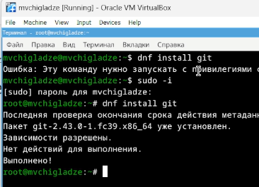{#fig:001 width=70%}
    
Установила gh Fedora:

    dnf install gh (рис. [-@fig:002])

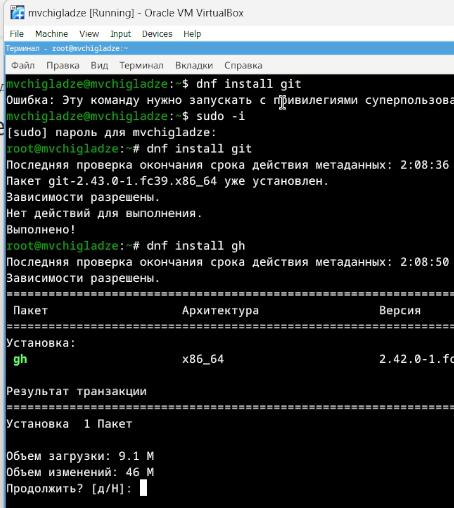{#fig:002 width=70%}

## Задание 2. Базовая настройка git

Зададила имя и email владельца репозитория:

    git config --global user.name "Name Surname"

    git config --global user.email "work@mail" (рис. [-@fig:003])

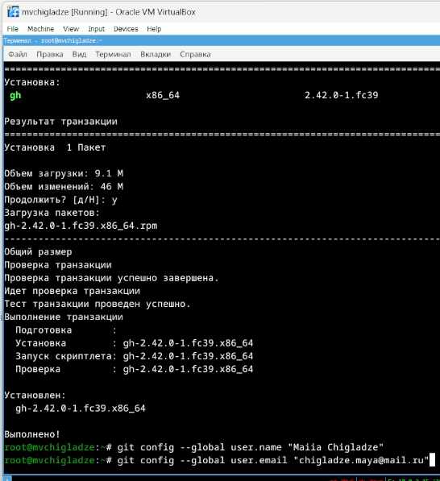{#fig:003 width=70%}

Настроила utf-8 в выводе сообщений git:

    git config --global core.quotepath false

Настроила верификацию и подписание коммитов git 

Задала имя начальной ветки (буду называть её master):

    git config --global init.defaultBranch master

Параметр autocrlf:

    git config --global core.autocrlf input

Параметр safecrlf:

    git config --global core.safecrlf warn (рис. [-@fig:004])

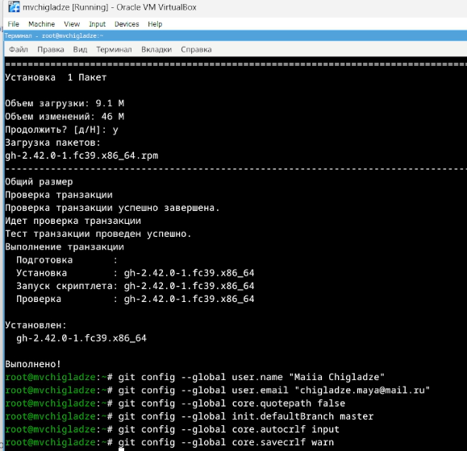{#fig:004 width=70%}

## Создание ключа ssh

По алгоритму rsa с ключём размером 4096 бит:

    ssh-keygen -t rsa -b 4096 (рис. [-@fig:005])

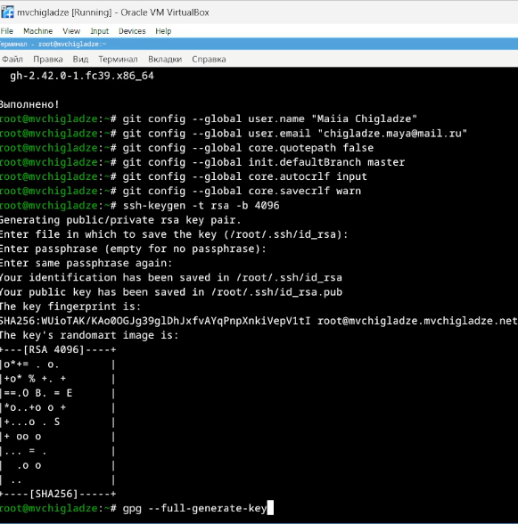{#fig:005 width=70%}

## Создание ключа pgp

Генерирую ключ

    gpg --full-generate-key (рис. [-@fig:006])

{#fig:006 width=70%}

## Настройка github

Так как аккаунт в гитхаб у меня есть, этот пункт пропускаю

## Добавление PGP ключа в GitHub

Вывожу список ключей и копируем отпечаток приватного ключа:

    gpg --list-secret-keys --keyid-format LONG (рис. [-@fig:007])

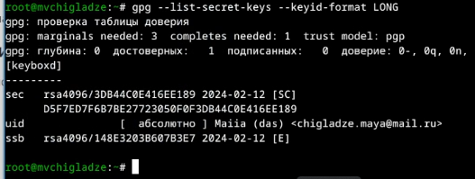{#fig:007 width=70%}

Копирую мой сгенерированный PGP ключ в буфер обмена:

    tgpg --armor --export <PGP Fingerprint> | xclip -sel clip (рис. [-@fig:008])

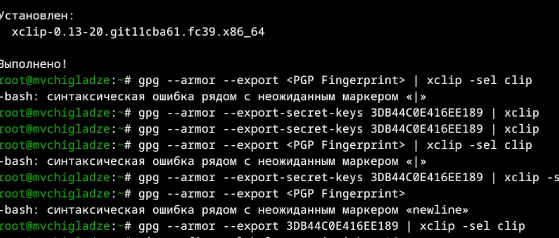{#fig:008 width=70%}

Перехожу в настройки GitHub (https://github.com/settings/keys), нажмите на кнопку New GPG key и вставьте полученный ключ в поле ввода.

## Настройка автоматических подписей коммитов git

Используя введёный email, указываю Git применять его при подписи коммитов:

    git config --global user.signingkey <PGP Fingerprint>

    git config --global commit.gpgsign true

    git config --global gpg.program $(which gpg2) (рис. [-@fig:009])

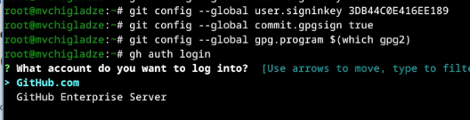{#fig:009 width=70%}

## Настройка gh

Для начала необходимо авторизоваться

    gh auth login (рис. [-@fig:010])

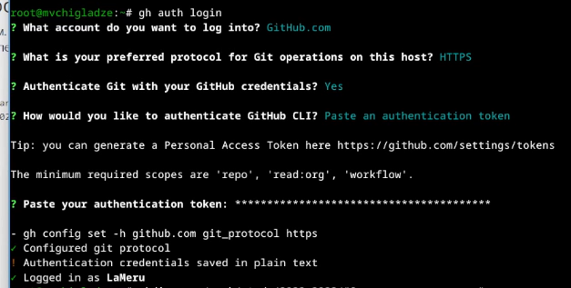{#fig:010 width=70%}

# Сознание репозитория курса на основе шаблона

Необходимо создать шаблон рабочего пространства.

    mkdir -p ~/work/study/2022-2023/"Операционные системы"

    cd ~/work/study/2022-2023/"Операционные системы"

    gh repo create study_2022-2023_os-intro --template=yamadharma/course-directory-student-template --public (рис. [-@fig:011])

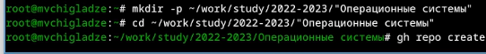{#fig:011 width=70%}

    git clone --recursive git@github.com:<owner>/study_2022-2023_os-intro.git os-intro (рис. [-@fig:012])

{#fig:012 width=70%}

# Настройка каталога курса

Перешла в каталог курса:

    cd ~/work/study/2022-2023/"Операционные системы"/os-intro

Удалила лишние файлы:

    rm package.json

Создала необходимые каталоги:

    echo os-intro > COURSE
    make

Отправила файлы на сервер:

    git add .
    git commit -am 'feat(main): make course structure'
    git push

Результат манипуляций виден в самом репозитории (рис. [-@fig:013])

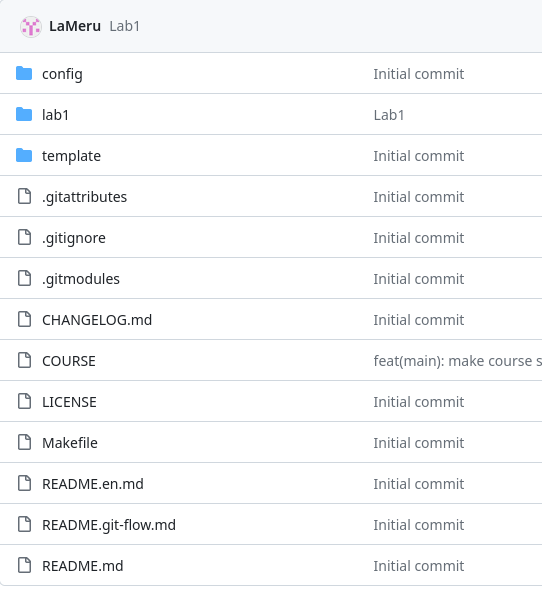{#fig:013 width=70%}

# **Контрольные вопросы**

## Лист вопросов

1) Что такое системы контроля версий (VCS) и для решения каких задач они предназначаются?
2) Объясните следующие понятия VCS и их отношения: хранилище, commit, история, рабочая копия.
3) Что представляют собой и чем отличаются централизованные и децентрализованные VCS? Приведите примеры VCS каждого вида.
4) Опишите действия с VCS при единоличной работе с хранилищем.
5) Опишите порядок работы с общим хранилищем VCS.
6) Каковы основные задачи, решаемые инструментальным средством git?
7) Назовите и дайте краткую характеристику командам git.
8) Приведите примеры использования при работе с локальным и удалённым репозиториями.
9) Что такое и зачем могут быть нужны ветви (branches)?
10) Как и зачем можно игнорировать некоторые файлы при commit?

## Лист ответов

1) Система управления версиями (также используется определение «система контроля версий», от англ. 
version control system, VCS или revision control system) — программное обеспечение для облегчения работы с изменяющейся информацией.
2) Основные понятия VCS:
Хранилище (repository) - это место, где хранятся все версии файла или проекта. Обычно это сервер, на котором установлен специальный сервер VCS.
Commit (фиксация) - это процесс добавления новой версии файла в хранилище. Разработчик делает коммит, когда вносит 
изменения в файл или набор файлов, и отправляет их на сервер VCS для сохранения.
История (history) - это список всех коммитов, которые были сделаны в проекте. Каждый коммит содержит информацию о том, 
какие изменения были внесены, кем они были внесены и когда. История позволяет разработчикам видеть, какие изменения были сделаны и когда, 
а также откатываться к предыдущим версиям в случае необходимости.
Рабочая копия (working copy) - это локальная копия проекта, с которой разработчик работает на своем компьютере. 
Рабочая копия синхронизируется с хранилищем, то есть разработчик может делать коммиты, которые затем отправляются
3) Централизованные VCS: вся информация о проекте хранится на центральном сервере, и все изменения в проекте делаются через этот сервер. 
Примеры: Git, Mercurial.
Децентрализованные VCS (DVCS): каждый разработчик имеет свою собственную копию проекта, и изменения могут делаться независимо на каждом компьютере. 
Затем изменения объединяются, и получается итоговая версия проекта. Примеры: Git (с использованием нескольких репозиториев), Mercurial 
(с использованием концепции “пулл-реквестов”).
4) При единоличной работе над проектом действия с VCS включают:
Создание репозитория на сервере VCS (если это еще не было сделано).
Клонирование репозитория на свой компьютер с помощью команды git clone.
Внесение изменений в проект на своем компьютере (рабочая копия).
Коммит изменений в репозиторий с помощью команды git commit.
Обновление рабочей копии с сервера с помощью команды git pull.
Просмотр истории изменений с помощью команды git log.
Эти действия позволяют сохранять историю изменений проекта, возвращаться 
к предыдущим версиям и работать над проектом без конфликтов.
5)Для работы с общим хранилищем необходимо выполнить следующие шаги:
Создать репозиторий на сервере
Отправить запрос на включение в проект (pull request)
Принять запрос и выполнить слияние изменений
6)Основные задачи, решаемые git:
Управление версиями: позволяет хранить историю изменений файлов и при необходимости возвращаться к предыдущим версиям.
Совместная работа: позволяет нескольким разработчикам работать над проектом одновременно, не мешая друг другу.
Отслеживание изменений: позволяет видеть, какие изменения были внесены в проект и кем.
Управление ветками: позволяет создавать ветки для параллельной разработки и затем объединять их в основную ветку проекта.
Мерджинг (слияние) веток: позволяет объединять изменения из разных веток в одну.
7)Основные команды Git:
git status: показывает текущее состояние репозитория;
git add: добавляет файлы в индекс (stage);
git commit: создает коммит (измененный набор файлов) и записывает его в репозиторий;
git branch: создает новую ветку или переключается на существующую;
git merge: объединяет две ветки в одну;
git push: отправляет коммиты на удаленный репозиторий;
git pull: обновляет рабочую копию репозитория с удаленного сервера;
git diff: показывает различия между двумя коммитами;
git log: выводит историю коммитов;
git reset: сбрасывает состояние индекса или рабочего каталога до определенного состояния.
8)При работе с локальным репозиторием:
Создание репозитория: git init.
Клонирование репозитория: git clone <url>.
Добавление файлов в индекс: git add <file>.
Коммит изменений: git commit -m "message".
Просмотр истории коммитов: git log
При работе с удаленным репозиторием (на примере GitHub):
Регистрация на сервисе: https://github.com.
Создание нового репозитория или клонирование существующего: https://github.com/your_username/your_repo_name.
Отправка запроса на включение в проект: https://github.com/your_username/your_repo_name/compare.
Принять запрос и выполнить слияние: https://help.github.com/articles/merging-a-pull-request/
9)Ветви в системе контроля версий позволяют разработчикам работать параллельно над различными частями 
проекта без риска повредить основную ветку проекта. Они могут создаваться для реализации новых функций, 
исправления ошибок или проведения рефакторинга кода. Когда разработчик создает ветку, он получает копию 
проекта со всеми его файлами и папками. Затем он может вносить изменения в эту ветку, не затрагивая основную 
ветку проекта. После того, как работа над веткой завершена, разработчик может объединить свои изменения с основной 
веткой проекта или предложить другим разработчикам оценить и принять эти изменения.
10) Можно использовать команду .gitignore чтобы игнорировать файлы при коммите. 
Это может быть полезно если вы не хотите чтобы в репозитории были видны файлы например 
с настройками вашего редактора или временные файлы. Вы можете создать файл .gitignore и 
добавить в него названия файлов или папок которые нужно игнорировать. 
Затем нужно добавить этот файл в репозиторий что бы он учитывался при коммите.

# **Выводы**

В ходе лабораторной работы, я изучила идеологию и применение средств контроля версий и освоить умения по работе с git.

# Список литературы{.unnumbered}

::: {#refs}
:::
