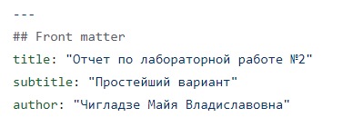
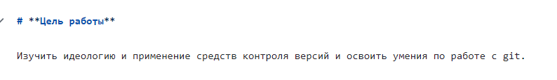
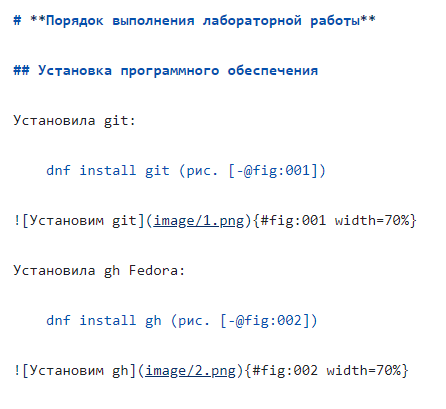
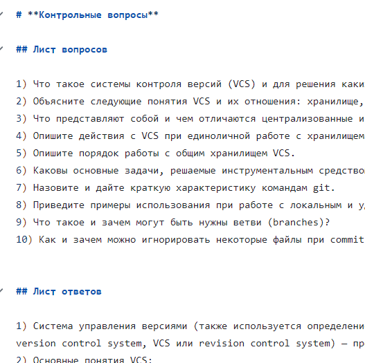
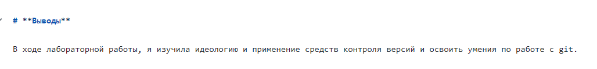
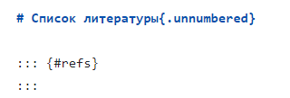
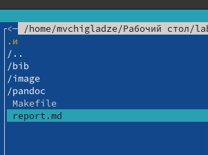
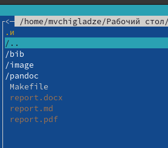

---
## Front matter
lang: ru-RU
title: Лабораторная работа 3
subtitle: Простейший шаблон
author:
  - Чигладзе М.В.
institute:
  - Российский университет дружбы народов, Москва, Россия
date: 29 мая 2003

## i18n babel
babel-lang: russian
babel-otherlangs: english

## Formatting pdf
toc: false
toc-title: Содержание
slide_level: 2
aspectratio: 169
section-titles: true
theme: metropolis
header-includes:
 - \metroset{progressbar=frametitle,sectionpage=progressbar,numbering=fraction}
 - '\makeatletter'
 - '\beamer@ignorenonframefalse'
 - '\makeatother'
 ## Fonts
mainfont: PT Serif
romanfont: PT Serif
sansfont: PT Sans
monofont: PT Mono
mainfontoptions: Ligatures=TeX
romanfontoptions: Ligatures=TeX
sansfontoptions: Ligatures=TeX,Scale=MatchLowercase
monofontoptions: Scale=MatchLowercase,Scale=0.9
---

# Информация

## Докладчик

:::::::::::::: {.columns align=center}
::: {.column width="70%"}

  * Чигладзе Майя Владиславовна
  * студент РУДН направления Прикладная информатика
  * заместитель ОСК профсоюза РУДН
  * волонтер университета и Москвы
  * [1132239399@pfur.ru]
  * <https://github.com/LaMeru>

:::
::: {.column width="30%"}

:::
::::::::::::::

# Вводная часть

## Актуальность
 - Лабораторная работа “Работа с Markdown” предоставляет студентам возможность изучить основы этого языка разметки, научиться применять различные стили форматирования текста, создавать заголовки, списки, таблицы и другие элементы, необходимые для создания качественного документа

## Объект и предмет исследования
 - Объект исследования данной лабораторной работы - система подготовки и оформления документов Markdown.
 - Предмет исследования - возможности языка разметки Markdown, его синтаксис и правила использования для создания форматированных текстовых документов.

## Цели и задачи
 - Научиться оформлять отчёты с помощью легковесного языка разметки Markdown.

## Материалы и методы

Методы исследования:
 - В ходе выполнения данной лабораторной работы будут использованы следующие материалы и методы:
 - Изучение теоретических основ работы с языком разметки Markdown.
 - Практическое применение Markdown для создания различных типов форматированного текста (заголовки, списки, таблицы, цитаты и т.д.).
 - Использование специализированных онлайн-сервисов для проверки правильности оформления Markdown-текста.
 - Анализ и сравнение различных подходов к использованию Markdown для решения конкретных задач.
 
# Оформление отчета

## Титульный лист

## Цель

## Основная часть

## Контрольные вопросы

## Выводы

## Список литературы

## До и после команды make

# Результаты

Результатами лабораторной работы 3 являются:
 - Получение необходимых знаний и навыков работы с языком Markdown
 - Создание 1-3 отчетов
