---
## Front matter
title: "Отчет по лабораторной работе №3"
subtitle: "Markdown"
author: "Чигладзе Майя Владиславовна"

## Generic otions
lang: ru-RU
toc-title: "Содержание"

## Bibliography
bibliography: bib/cite.bib
csl: pandoc/csl/gost-r-7-0-5-2008-numeric.csl

## Pdf output format
toc: true # Table of contents
toc-depth: 2
lof: true # List of figures
lot: true # List of tables
fontsize: 12pt
linestretch: 1.5
papersize: a4
documentclass: scrreprt
## I18n polyglossia
polyglossia-lang:
  name: russian
  options:
    - spelling=modern
    - babelshorthands=true
polyglossia-otherlangs:
  name: english
## I18n babel
babel-lang: russian
babel-otherlangs: english
## Fonts
mainfont: PT Serif
romanfont: PT Serif
sansfont: PT Sans
monofont: PT Mono
mainfontoptions: Ligatures=TeX
romanfontoptions: Ligatures=TeX
sansfontoptions: Ligatures=TeX,Scale=MatchLowercase
monofontoptions: Scale=MatchLowercase,Scale=0.9
## Biblatex
biblatex: true
biblio-style: "gost-numeric"
biblatexoptions:
  - parentracker=true
  - backend=biber
  - hyperref=auto
  - language=auto
  - autolang=other*
  - citestyle=gost-numeric
## Pandoc-crossref LaTeX customization
figureTitle: "Рис."
tableTitle: "Таблица"
listingTitle: "Листинг"
lofTitle: "Список иллюстраций"
lotTitle: "Список таблиц"
lolTitle: "Листинги"
## Misc options
indent: true
header-includes:
  - \usepackage{indentfirst}
  - \usepackage{float} # keep figures where there are in the text
  - \floatplacement{figure}{H} # keep figures where there are in the text
---

# **Цель работы**

Научиться оформлять отчёты с помощью легковесного языка разметки Markdown.

# **Порядок выполнения лабораторной работы**

## Структура созданного отчета

Титульный лист состоит из ФИО студента, название работы и подназвания (рис. 1)

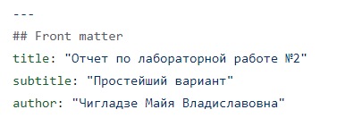{#fig:001 width=70%}
    
Далее представлены всякого рода настройки и команды, невидные в конечном пдф файле (рис. 2)

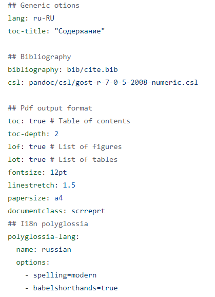{#fig:002 width=70%}

Цель работы я беру из файла лабораторной работы в ТУИСе (рис. 3)

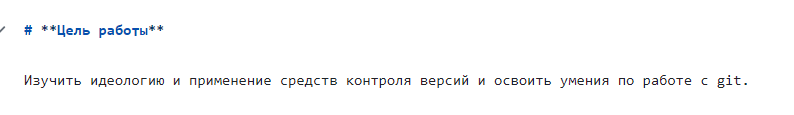{#fig:003 width=70%}

Выполняя лабораторную работу, я делю все на большие и средние блоки, исходя
из того как это представлено в лабораторной работе, также все
сопровождаю рисунками и ссылкой на них (рис. 4)

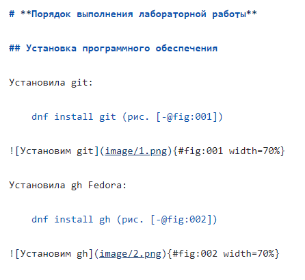{#fig:004 width=70%}

Если же отсутствует домашнее задание,  я приступаю к 
контрольным вопросам (рис. 5)

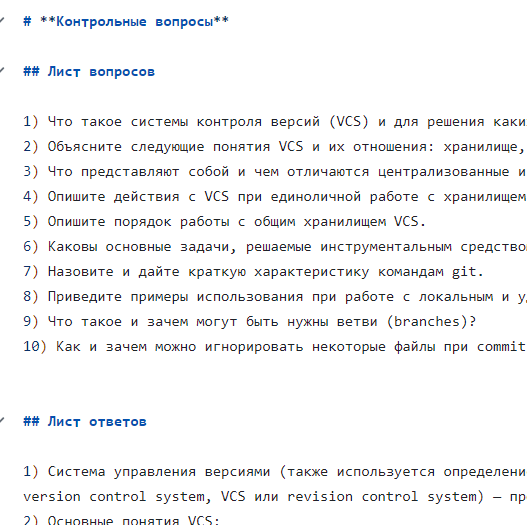{#fig:005 width=70%}

Пишу вывод по цели лабораторной работы (рис. 6)

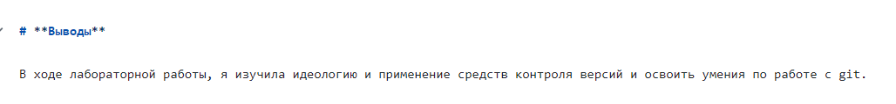{#fig:006 width=70%}

Список литературы оставляю пустым (рис. 7)

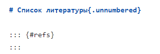{#fig:007 width=70%}

#Конвертация

Для конвертации использую команду
    
    make (рис. 8)

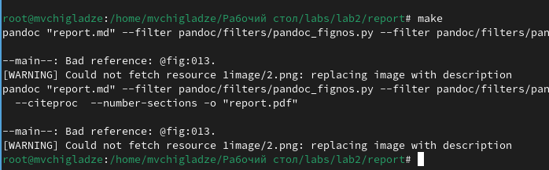{#fig:008 width=70%}

До (рис. 9)

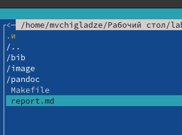{#fig:009 width=70%}

После (рис. 10)

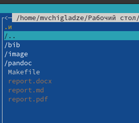{#fig:010 width=70%}

# Результат

Результат команды make в pdf файле (рис. 11)

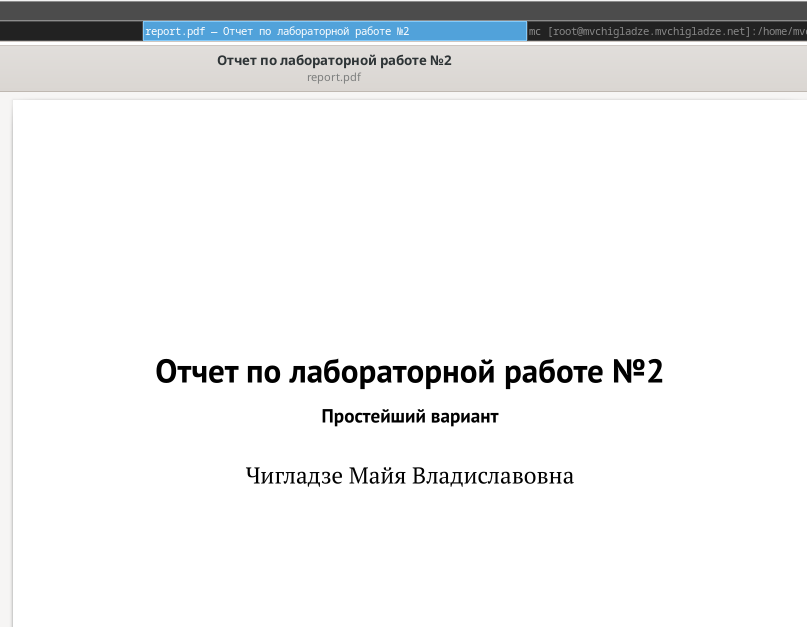{#fig:011 width=70%}

# **Выводы**

В ходе лабораторной работы, я научилась оформлять отчёты с помощью легковесного языка разметки Markdown.

# Список литературы{.unnumbered}

::: {#refs}
:::

