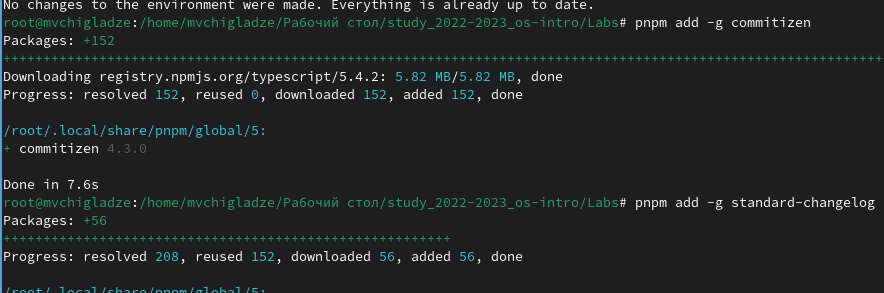
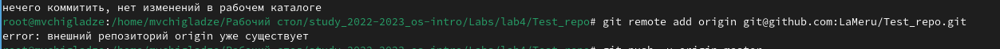

---
## Front matter
title: "Отчет по лабораторной работе 4"
subtitle: "Продвинутое использование git"
author: "Чигладзе Майя Владиславовна"

## Generic otions
lang: ru-RU
toc-title: "Содержание"

## Bibliography
bibliography: bib/cite.bib
csl: pandoc/csl/gost-r-7-0-5-2008-numeric.csl

## Pdf output format
toc: true # Table of contents
toc-depth: 2
lof: true # List of figures
lot: true # List of tables
fontsize: 12pt
linestretch: 1.5
papersize: a4
documentclass: scrreprt
## I18n polyglossia
polyglossia-lang:
  name: russian
  options:
    - spelling=modern
    - babelshorthands=true
polyglossia-otherlangs:
  name: english
## I18n babel
babel-lang: russian
babel-otherlangs: english
## Fonts
mainfont: PT Serif
romanfont: PT Serif
sansfont: PT Sans
monofont: PT Mono
mainfontoptions: Ligatures=TeX
romanfontoptions: Ligatures=TeX
sansfontoptions: Ligatures=TeX,Scale=MatchLowercase
monofontoptions: Scale=MatchLowercase,Scale=0.9
## Biblatex
biblatex: true
biblio-style: "gost-numeric"
biblatexoptions:
  - parentracker=true
  - backend=biber
  - hyperref=auto
  - language=auto
  - autolang=other*
  - citestyle=gost-numeric
## Pandoc-crossref LaTeX customization
figureTitle: "Рис."
tableTitle: "Таблица"
listingTitle: "Листинг"
lofTitle: "Список иллюстраций"
lotTitle: "Список таблиц"
lolTitle: "Листинги"
## Misc options
indent: true
header-includes:
  - \usepackage{indentfirst}
  - \usepackage{float} # keep figures where there are in the text
  - \floatplacement{figure}{H} # keep figures where there are in the text
---

# **Цель работы**

Получение навыков правильной работы с репозиториями git.

# **Порядок выполнения лабораторной работы**

## Задание 1.  Установка git-flow

Установила из коллекции репозиториев Copr 

    dnf copr enable elegos/gitflow (рис. 1).

{#fig:001 width=70%}

    Install gitflow dnf install gitflow (рис. 2).

{#fig:002 width=70%}

## Задание 2.  Установка Node.js

На Node.js базируется программное обеспечение для семантического версионирования и общепринятых коммитов.

    dnf install nodejs (рис. 3).

{#fig:003 width=70%}

## Задание 3. Настройка Node.js

Для работы с Node.js добавила каталог с исполняемыми файлами, устанавливаемыми yarn, в переменную PATH.

    pnpm setup (рис. 4).

{#fig:004 width=70%}

Перелогинилась, или выполнила:

    source ~/.bashrc (рис. 5).

{#fig:005 width=70%}

## Задание 4. Общепринятые коммиты

Данная программа используется для помощи в форматировании коммитов.

    pnpm add -g commitizen (рис. 6).

{#fig:006 width=70%}

Данная программа используется для помощи в создании логов.

    pnpm add -g standard-changelog (рис. 7).

{#fig:007 width=70%}

Делаю первый коммит и выкладываем на github

    git commit -m "first commit" (рис. 8).

{#fig:008 width=70%}

    git remote add origin git@github.com:<username>/git-extended.git git push -u origin master (рис. 10).

{#fig:010 width=70%}

Конфигурация для пакетов Node.js 

    pnpm init (рис. 11).

{#fig:011 width=70%}

Сконфигурим формат коммитов. Для этого добавим в файл package.json команду для формирования коммитов. package.json приобрел вид (рис. 12).

{#fig:012 width=70%}

Добавила новые файлы 

    git add . (рис. 13).

{#fig:013 width=70%}

Выполнила коммит

    git cz (рис. 14).

{#fig:014 width=70%}

Отправила на github

    git push (рис. 15).

{#fig:015 width=70%}

Инициализирую git-flow

    git flow init (рис. 16).

{#fig:016 width=70%}

Проверила, что я на ветке develop

    git branch (рис. 17).

{#fig:017 width=70%}

Загрузила весь репозиторий в хранилище

    git push --all (рис. 18).

{#fig:018 width=70%}

Установила внешнюю ветку как вышестоящую для этой ветки 

    git branch --set-upstream-to=origin/develop develop (рис. 19).

{#fig:019 width=70%}

Создала релиз с версией 1.0.0 

    git flow release start 1.0.0 (рис. 20).

{#fig:020 width=70%}

Создала журнал изменений

    standard-changelog --first-release (рис. 21).

{#fig:021 width=70%}

Добавила журнал изменений в индекс

    git add CHANGELOG.md
    
    git commit -am 'chore(site): add changelog' (рис. 22).

{#fig:022 width=70%}

Залила релизную ветку в основную ветку

    git flow release finish 1.0.0 (рис. 23).

{#fig:023 width=70%}

Отправила данные на github
    
    git push --all (рис. 24).

{#fig:024 width=70%}

Создала релиз на github. Для этого будем использовать утилиты работы с github

    gh release create v1.0.0 -F CHANGELOG.md (рис. 25).

{#fig:025 width=70%}

Создала ветку для новой функциональности

    git flow feature start feature_branch (рис. 26).

{#fig:026 width=70%}

По окончании разработки новой функциональности следующим шагом объединила ветку feature_branch c develop

    git flow feature finish feature_branch (рис. 27).

{#fig:027 width=70%}

Создала релиз с версией 1.2.3

    git flow release start 1.2.3 (рис. 28).

{#fig:028 width=70%}

Создала журнал изменений

    standard-changelog (рис. 29).

{#fig:029 width=70%}

Добавила журнал изменений в индекс

    git add CHANGELOG.md
    
    git commit -am 'chore(site): update changelog' (рис. 30).

{#fig:030 width=70%}

Залила релизную ветку в основную ветку

    git flow release finish 1.2.3 (рис. 31).

{#fig:031 width=70%}

Отправила данные на github

    git push --all
    
    git push --tags (рис. 32).

{#fig:032 width=70%}

Создала релиз на github с комментарием из журнала изменений

    gh release create v1.2.3 -F CHANGELOG.md (рис. 33).

{#fig:033 width=70%}
    
# **Выводы** 

В ходе лабораторной работы, я получила навыки правильной работы с репозиториями git.

# Список литературы{.unnumbered}

::: {#refs}
:::

