---
## Front matter
title: "Отчет по лабораторной работе №4"
subtitle: "Настройка рабочей среды"
author: "Чигладзе Майя Владиславовна"

## Generic otions
lang: ru-RU
toc-title: "Содержание"

## Bibliography
bibliography: bib/cite.bib
csl: pandoc/csl/gost-r-7-0-5-2008-numeric.csl

## Pdf output format
toc: true # Table of contents
toc-depth: 2
lof: true # List of figures
lot: true # List of tables
fontsize: 12pt
linestretch: 1.5
papersize: a4
documentclass: scrreprt
## I18n polyglossia
polyglossia-lang:
  name: russian
  options:
    - spelling=modern
    - babelshorthands=true
polyglossia-otherlangs:
  name: english
## I18n babel
babel-lang: russian
babel-otherlangs: english
## Fonts
mainfont: PT Serif
romanfont: PT Serif
sansfont: PT Sans
monofont: PT Mono
mainfontoptions: Ligatures=TeX
romanfontoptions: Ligatures=TeX
sansfontoptions: Ligatures=TeX,Scale=MatchLowercase
monofontoptions: Scale=MatchLowercase,Scale=0.9
## Biblatex
biblatex: true
biblio-style: "gost-numeric"
biblatexoptions:
  - parentracker=true
  - backend=biber
  - hyperref=auto
  - language=auto
  - autolang=other*
  - citestyle=gost-numeric
## Pandoc-crossref LaTeX customization
figureTitle: "Рис."
tableTitle: "Таблица"
listingTitle: "Листинг"
lofTitle: "Список иллюстраций"
lotTitle: "Список таблиц"
lolTitle: "Листинги"
## Misc options
indent: true
header-includes:
  - \usepackage{indentfirst}
  - \usepackage{float} # keep figures where there are in the text
  - \floatplacement{figure}{H} # keep figures where there are in the text
---

# **Порядок выполнения лабораторной работы**

## Задание 1.  Менеджер паролей pass

1. Установка

dnf install pass pass-otp (рис. 1).

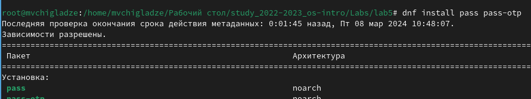{#fig:001 width=70%}

dnf install gopass (рис. 2).

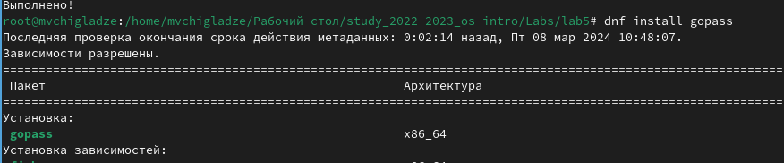{#fig:002 width=70%}

2. Настройка

Просмотрела списка ключей

 gpg --list-secret-keys (рис. 3).

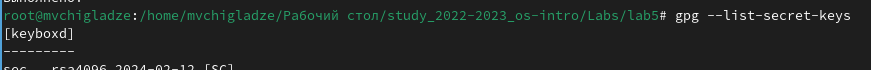{#fig:003 width=70%}

Инициализировала хранилище

 pass init <gpg-id or email> (рис. 4).

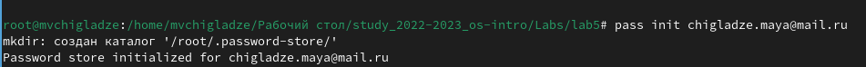{#fig:004 width=70%}

 Создала структуры git
 
  pass git init (рис. 5).

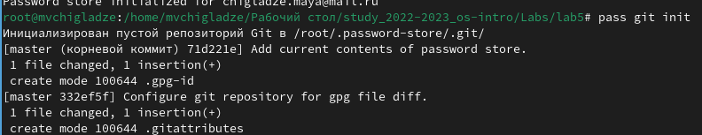{#fig:005 width=70%}

Для синхронизации выполнила следующую команду:

 pass git pull (рис. 6).

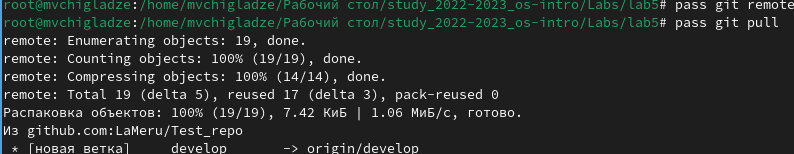{#fig:006 width=70%}

 Если изменения сделаны непосредственно на файловой системе, вручную закоммитила и выложила изменения
 
 cd ~/.password-store/ (рис. 7).

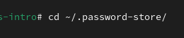{#fig:007 width=70%}

     git add . (рис. 8).

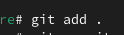{#fig:008 width=70%}

   git commit -am 'edit manually'  (рис. 9).

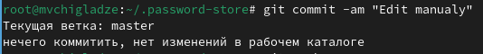{#fig:009 width=70%}

  git push (рис. 10).

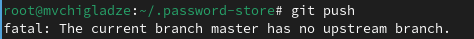{#fig:010 width=70%}

 Проверила статус синхронизации
 
  pass git status (рис. 11).

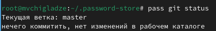{#fig:011 width=70%}

3. Настройка интерфейса с броузером

 dnf copr enable maximbaz/browserpass (рис. 12).

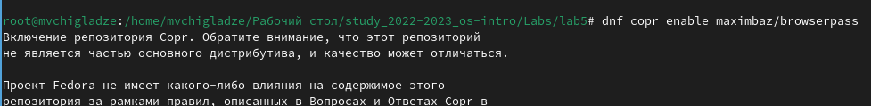{#fig:012 width=70%}

  dnf install browserpass (рис. 13).

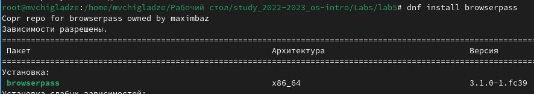{#fig:013 width=70%}

4. Сохранение пароля

 Добавила новый пароль
  
  pass insert [OPTIONAL DIR]/[FILENAME] (рис. 14).

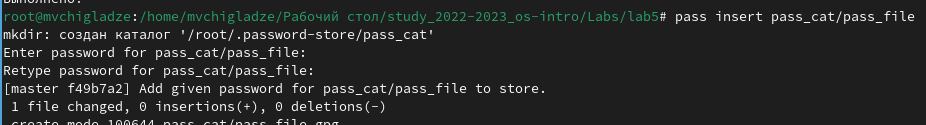{#fig:014 width=70%}

Отобразила пароль для указанного имени файла 

 pass [OPTIONAL DIR]/[FILENAME](рис. 15).

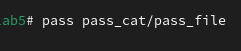{#fig:015 width=70%}

 Заменила существующий пароль:
 
  pass generate --in-place FILENAME (рис. 16).

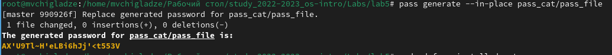{#fig:016 width=70%}

## Задание 2.  Управление файлами конфигурации 

1. Дополнительное программное обеспечение

Установила дополнительное программное обеспечение

 sudo dnf -y install \
 
         dunst \ (рис. 17).

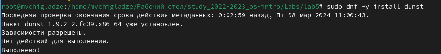{#fig:017 width=70%}

         fontawesome-fonts \ (рис. 18).

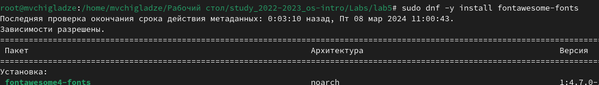{#fig:018 width=70%}

         powerline-fonts \ (рис. 19).

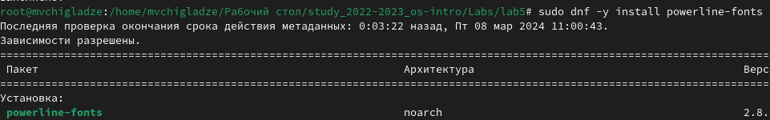{#fig:019 width=70%}

         light \ (рис. 20).

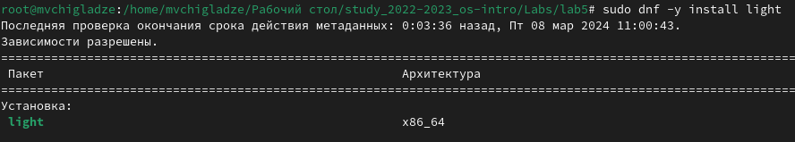{#fig:020 width=70%}

         fuzzel \ (рис. 21).

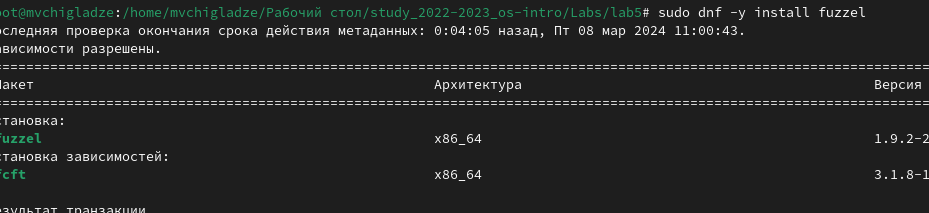{#fig:021 width=70%}

         swaylock \ (рис. 22).

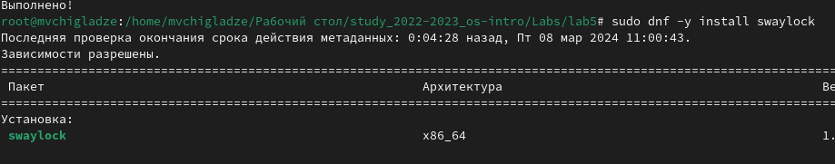{#fig:022 width=70%}

         kitty \ (рис. 23).

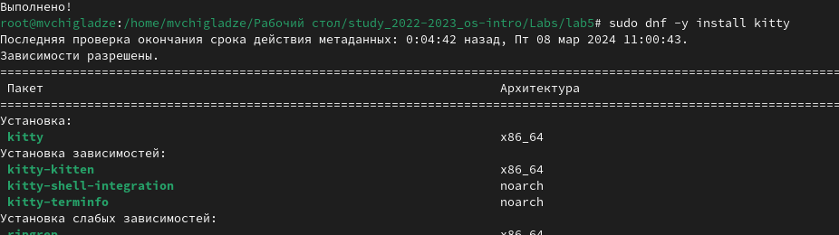{#fig:023 width=70%}

         waybar swaybg \ (рис. 24).

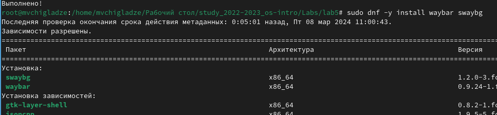{#fig:024 width=70%}

         wl-clipboard \ (рис. 25).

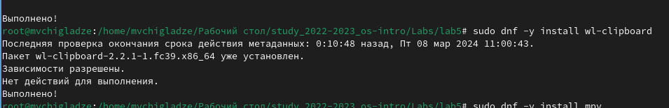{#fig:025 width=70%}

         mpv \ (рис. 26).

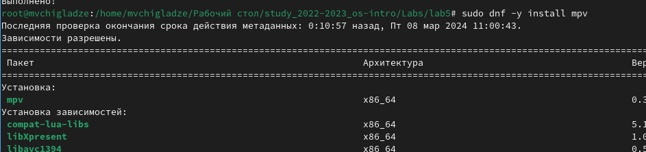{#fig:026 width=70%}
         
         grim \ (рис. 27).

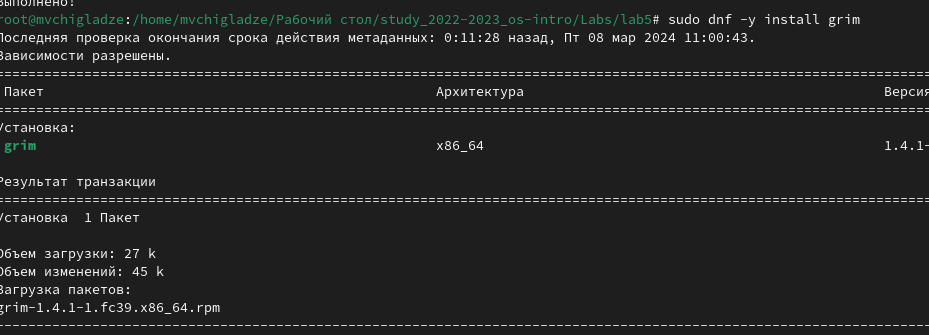{#fig:027 width=70%}
         
         slurp (рис. 28).

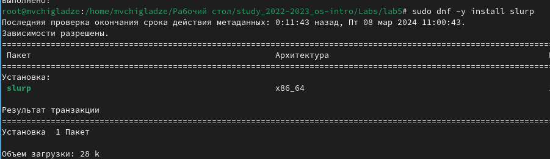{#fig:028 width=70%}

 Установила шрифты
 
  sudo dnf copr enable peterwu/iosevka (рис. 29).

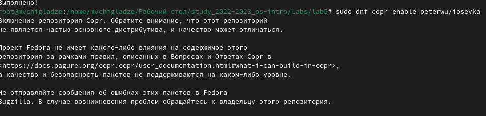{#fig:029 width=70%}

    sudo dnf search iosevka (рис. 30).

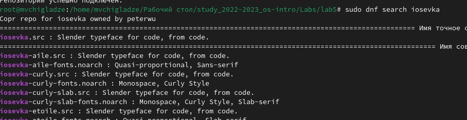{#fig:030 width=70%}

    sudo dnf install iosevka-fonts iosevka-aile-fonts iosevka-curly-fonts iosevka-slab-fonts iosevka-etoile-fonts iosevka-term-fonts (рис. 31).

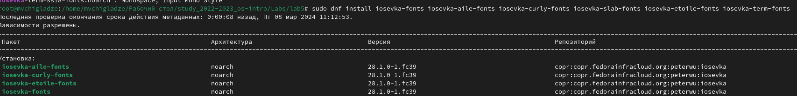{#fig:031 width=70%}

2. Установка

 Установила бинарный файла. Скрипт определяет архитектуру процессора и операционную систему и скачивает необходимый файл
 
   sh -c "$(wget -qO- chezmoi.io/get)" (рис. 32).

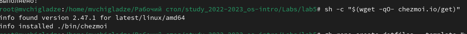{#fig:032 width=70%}

3. Создание собственного репозитория с помощью утилит

  Создала свой репозиторий для конфигурационных файлов на основе шаблона
  
   gh repo create dotfiles --template="yamadharma/dotfiles-template" --private  (рис. 33).

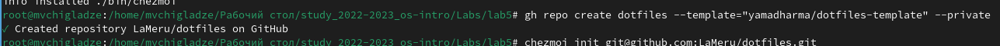{#fig:033 width=70%}

4. Подключение репозитория к своей системе

 Инициализировала chezmoi с моим репозиторием dotfiles:

    chezmoi init git@github.com:<username>/dotfiles.git

    Проверила, какие изменения внесёт chezmoi в домашний каталог, запустив:

    chezmoi diff

    Запустила:

    chezmoi apply -v (рис. 34).

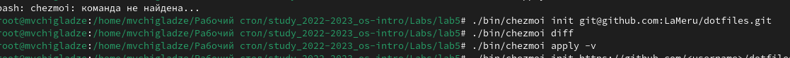{#fig:034 width=70%}

5. Использование chezmoi на нескольких машинах

  На второй машине инициализировала chezmoi с вашим репозиторием dotfiles:

    chezmoi init https://github.com/<username>/dotfiles.git

    Проверила, какие изменения внесёт chezmoi в домашний каталог, запустив:

    chezmoi diff

    запустила:

    chezmoi apply -v (рис. 35).

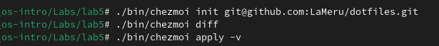{#fig:035 width=70%}

6. Ежедневные операции c chezmoi

    При существующем каталоге chezmoi можно получить и применить последние изменения из моего репозитория:

    chezmoi update -v (рис. 36).

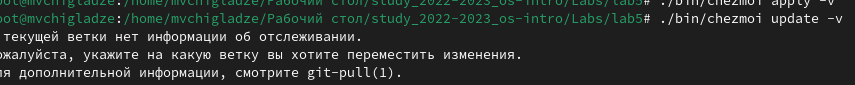{#fig:036 width=70%}

Извлеките последние изменения из своего репозитория и посмотрите, что изменится, фактически не применяя изменения

        Выполните:

        chezmoi git pull -- --autostash --rebase && chezmoi diff (рис. 37).

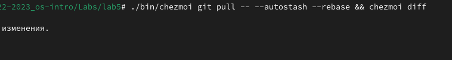{#fig:037 width=70%}

Чтобы включить её, добавьте в файл конфигурации ~/.config/chezmoi/chezmoi.toml следующее (рис. 38).

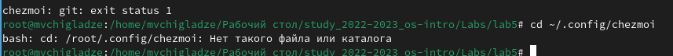{#fig:038 width=70%}

# **Выводы** 

В ходе лабораторной работы, я настроила свою рабочую среду.

# Список литературы{.unnumbered}

::: {#refs}
:::

