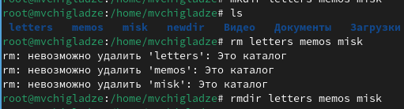
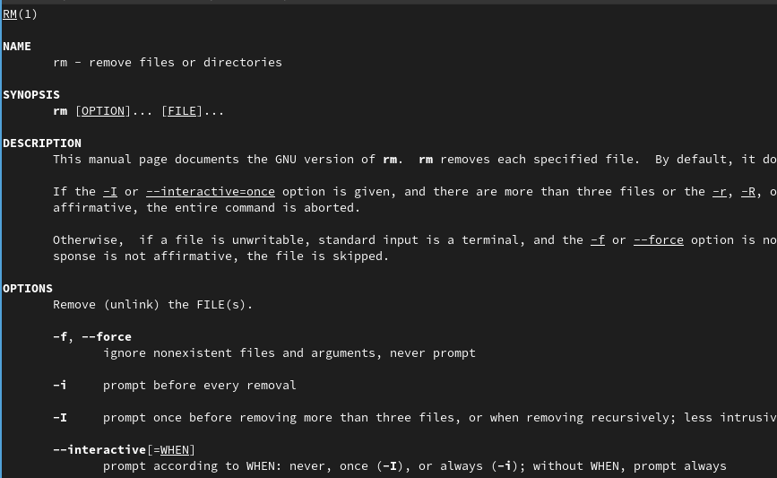

---
## Front matter
title: "Отчет по лабораторной работе №6"
subtitle: "Основы интерфейса взаимодействия пользователя с системой Unix на уровне командной строки"
author: "Чигладзе Майя Владиславовна"

## Generic otions
lang: ru-RU
toc-title: "Содержание"

## Bibliography
bibliography: bib/cite.bib
csl: pandoc/csl/gost-r-7-0-5-2008-numeric.csl

## Pdf output format
toc: true # Table of contents
toc-depth: 2
lof: true # List of figures
lot: true # List of tables
fontsize: 12pt
linestretch: 1.5
papersize: a4
documentclass: scrreprt
## I18n polyglossia
polyglossia-lang:
  name: russian
  options:
    - spelling=modern
    - babelshorthands=true
polyglossia-otherlangs:
  name: english
## I18n babel
babel-lang: russian
babel-otherlangs: english
## Fonts
mainfont: PT Serif
romanfont: PT Serif
sansfont: PT Sans
monofont: PT Mono
mainfontoptions: Ligatures=TeX
romanfontoptions: Ligatures=TeX
sansfontoptions: Ligatures=TeX,Scale=MatchLowercase
monofontoptions: Scale=MatchLowercase,Scale=0.9
## Biblatex
biblatex: true
biblio-style: "gost-numeric"
biblatexoptions:
  - parentracker=true
  - backend=biber
  - hyperref=auto
  - language=auto
  - autolang=other*
  - citestyle=gost-numeric
## Pandoc-crossref LaTeX customization
figureTitle: "Рис."
tableTitle: "Таблица"
listingTitle: "Листинг"
lofTitle: "Список иллюстраций"
lotTitle: "Список таблиц"
lolTitle: "Листинги"
## Misc options
indent: true
header-includes:
  - \usepackage{indentfirst}
  - \usepackage{float} # keep figures where there are in the text
  - \floatplacement{figure}{H} # keep figures where there are in the text
---

# **Цель работы**

Приобретение практических навыков взаимодействия пользователя с системой посредством командной строки.

# **Порядок выполнения лабораторной работы**

## Задание 1

Определила полное имя домашнего каталога pwd (рис. 1).

{#fig:001 width=70%}

## Задание 2

Выполнила следующие действия:

1. Перешла в каталог cd /tmp.(рис. 2).

{#fig:002 width=70%}

2. Вывела на экран содержимое каталога /tmp. Для этого использовала команду ls
с различными опциями. 
Некоторые файлы в операционной системе скрыты от просмотра и обычно используются для настройки рабочей среды. Имена таких файлов начинаются с точки. Для
того, чтобы отобразить имена скрытых файлов, необходимо использовать команду ls с опцией a:

    ls -a
    
Можно также получить информацию о типах файлов (каталог, исполняемый файл,ссылка), для чего используется опция F. При использовании этой опции в поле имени
выводится символ, который определяет тип файла

    ls -F * (рис. 3).

{#fig:003 width=70%}

Чтобы вывести на экран подробную информацию о файлах и каталогах, необходимо
использовать опцию l

    ls -l (рис. 4).

{#fig:004 width=70%}
    
3. Определила, есть ли в каталоге /var/spool подкаталог с именем cron? Есть.

    ls (рис. 5).

{#fig:005 width=70%}

4. Перешла в Ваш домашний каталог и вывела на экран его содержимое. Определила, кто является владельцем файлов и подкаталогов
Владелец: mvchigladze (рис. 6). Команда:

    pwd

{#fig:006 width=70%}

## Задание 3

1. В домашнем каталоге создала новый каталог с именем newdir командой:

    mkdir newdir

2. В каталоге ~/newdir создала новый каталог с именем morefun командой:

    mkdir ./newdir/morefun (рис. 7).

{#fig:007 width=70%}

3. В домашнем каталоге создала одной командой три новых каталога с именами
letters, memos, misk. Затем удалила эти каталоги одной командой. Используя команды:

    mkdir letters memod misk
    rmdir letters memos misk (рис. 8).

{#fig:008 width=70%}

4. Попробовала удалить ранее созданный каталог ~/newdir командой rm. Проверила,
был ли каталог удалён. Нет, не был. Результат на рисунке. (рис. 9).

{#fig:009 width=70%}

5. Удалила каталог ~/newdir/morefun из домашнего каталога. Проверила, был ли
каталог удалён.Да, был. Результат на рисунке

    rm -r newdir
    y
    y (рис. 10).

{#fig:010 width=70%}

## Задание 4

С помощью команды man определила, какую опцию команды ls нужно использовать для просмотра содержимое не только указанного каталога, но и подкаталогов,
входящих в него. Функция -a. (рис. 11).

{#fig:011 width=70%}

## Задание 5

С помощью команды man определила набор опций команды ls, позволяющий отсортировать по времени последнего изменения выводимый список содержимого каталога
с развёрнутым описанием файлов. Опция -t (рис. 12).

{#fig:012 width=70%}

## Задание 6

Использовала команду man для просмотра описания следующих команд: cd, pwd, mkdir,
rmdir, rm. Поясните основные опции этих команд.

cd (рис. 13)
−L , переходить по символическим ссылкам . По умолчанию cd ведет себя так, как если бы указана опция -L .
−P , не переходите по символическим ссылкам. Другими словами, когда эта опция указана, и вы пытаетесь перейти к символической ссылке, которая указывает на каталог, cd перейдет в каталог.

{#fig:013 width=70%}

pwd(рис. 14).
-L — использовать PWD из окружения, даже если оно содержит симлинки
-P — исключить все симлинки и вывести фактический путь

{#fig:014 width=70%}

mkdir(рис. 15).
-m (--mode=режим) - назначить режим доступа (права). По умолчанию mod принимает значение 0777, что обеспечивает неограниченные права.
-p (--parents) - не показывать ошибки, а также их игнорировать.
-z  (--context=CTX ) принимает контекст SELinux для каталога по умолчанию.
-v (--verbose) - выводить сообщение о каждом новым каталоге.
--help - вывести справочную информацию.
--version - выводит информацию о текущей версии утилиты.

{#fig:015 width=70%}

rmdir(рис. 16).
-p: Эта опция удаляет каталог, включая всех его предков
-v, –verbose: отображает подробную информацию для каждого каталога.
–игнорировать-сбой-при-непустом: этот параметр не сообщает о сбое, который возникает из-за того, что каталог непустой.
–version: Эта опция отображает информацию о версии и завершает работу.

{#fig:016 width=70%}

rm(рис. 17).
-f, --force
Игнорировать несуществующие файлы и аргументы, ни о чём не спрашивать
-i
Запрашивать подтверждение перед каждым удалением
-I
Запрашивать подтверждение один раз перед удалением более трёх файлов или перед рекурсивным удалением; не так назойливо, как с -i, но всё же защищает от большинства ошибок

{#fig:017 width=70%}

## Задание 7

Используя информацию, полученную при помощи команды history, выполните модификацию и исполнение нескольких команд из буфера команд.(рис. 18).
Я решила использовать модификации команды ls.

{#fig:018 width=70%}

# **Выводы**

В ходе лабораторной работы, я приобрела практические навыки взаимодействия пользователя с системой посредством командной строки.

# Список литературы{.unnumbered}

::: {#refs}
:::

