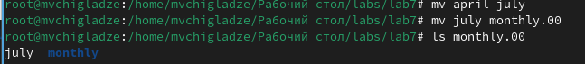
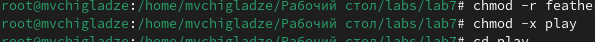

---
## Front matter
title: "Отчет по лабораторной работе №7"
subtitle: "Анализ файловой системы Linux. Команды для работы с файлами и каталогами"
author: "Чигладзе Майя Владиславовна"

## Generic otions
lang: ru-RU
toc-title: "Содержание"

## Bibliography
bibliography: bib/cite.bib
csl: pandoc/csl/gost-r-7-0-5-2008-numeric.csl

## Pdf output format
toc: true # Table of contents
toc-depth: 2
lof: true # List of figures
lot: true # List of tables
fontsize: 12pt
linestretch: 1.5
papersize: a4
documentclass: scrreprt
## I18n polyglossia
polyglossia-lang:
  name: russian
  options:
    - spelling=modern
    - babelshorthands=true
polyglossia-otherlangs:
  name: english
## I18n babel
babel-lang: russian
babel-otherlangs: english
## Fonts
mainfont: PT Serif
romanfont: PT Serif
sansfont: PT Sans
monofont: PT Mono
mainfontoptions: Ligatures=TeX
romanfontoptions: Ligatures=TeX
sansfontoptions: Ligatures=TeX,Scale=MatchLowercase
monofontoptions: Scale=MatchLowercase,Scale=0.9
## Biblatex
biblatex: true
biblio-style: "gost-numeric"
biblatexoptions:
  - parentracker=true
  - backend=biber
  - hyperref=auto
  - language=auto
  - autolang=other*
  - citestyle=gost-numeric
## Pandoc-crossref LaTeX customization
figureTitle: "Рис."
tableTitle: "Таблица"
listingTitle: "Листинг"
lofTitle: "Список иллюстраций"
lotTitle: "Список таблиц"
lolTitle: "Листинги"
## Misc options
indent: true
header-includes:
  - \usepackage{indentfirst}
  - \usepackage{float} # keep figures where there are in the text
  - \floatplacement{figure}{H} # keep figures where there are in the text
---

# **Цель работы**

Ознакомление с файловой системой Linux, её структурой, именами и содержанием
каталогов. Приобретение практических навыков по применению команд для работы
с файлами и каталогами, по управлению процессами (и работами), по проверке 
использования диска и обслуживанию файловой системы

# **Порядок выполнения лабораторной работы**

## Задание 1.  Выполнить все примеры, приведённые в первой части описания лабораторной работы.

1. Скопировала файл ~/abc1 в файл april и в файл may
    cd
    touch abc1
    cp abc1 april
    cp abc1 may (рис. 1).

{#fig:001 width=70%}
    
2. Скопировала файлы april и may в каталог monthly
    mkdir monthly
    cp april may monthly (рис. 2).

{#fig:002 width=70%}

3. Скопировала файл monthly/may в файл с именем june
    cp monthly/may monthly/june
    ls monthly (рис. 3).

{#fig:003 width=70%}

4. Скопировала каталог monthly в каталог monthly.00
    mkdir monthly.00
    cp -r monthly monthly.00 (рис. 4).

{#fig:004 width=70%}

5.  Скопировала каталог monthly.00 в каталог /tmp
    cp -r monthly.00 /tmp (рис. 5).

{#fig:005 width=70%}

6. Изменила название файла april на july в домашнем каталоге
    cd
    mv april july (рис. 6).

{#fig:006 width=70%}

7. Изменила название файла april на july в домашнем каталоге
    cd
    mv april july (рис. 7).

{#fig:007 width=70%}

8. Переименовала каталог monthly.00 в monthly.01
    mv monthly.00 monthly.01 (рис. 8).

{#fig:008 width=70%}

9.  Переместила каталог monthly.01в каталог reports:
    mkdir report
    mv monthly.01 reports (рис. 9).

{#fig:009 width=70%}

10. Переименовала каталог reports/monthly.01 в reports/monthly
    mv reports/monthly.01 reports/monthly (рис. 10).

{#fig:010 width=70%}

11. Создала файл ~/may с правом выполнения для владельца 
    cd
    touch may
    ls -l may
    chmod u+x may
    ls -l may (рис. 11).

{#fig:011 width=70%}

12. Лишила владельца файла ~/may права на выполнение
    chmod u-x may
    ls -l may (рис. 12).

{#fig:012 width=70%}

13. Создала каталог monthly с запретом на чтение для членов группы и всех
остальных пользователей
    cd
    mkdir monthly
    chmod g-r, o-r monthly (рис. 13).

{#fig:013 width=70%}

14. Создала файл ~/abc1 с правом записи для членов группы
    cd
    touch abc1
    chmod g+w abc1 (рис. 14).

{#fig:014 width=70%}

## Задание 2.  Выполнить следующие действия, зафиксировав в отчёте по лабораторной работе используемые при этом команды и результаты их выполнения

1. Скопировала файл /usr/include/sys/io.h в домашний каталог и назвала его equipment. (рис. 15).

{#fig:015 width=70%}

2.  В домашнем каталоге создала директорию ~/ski.plases. (рис. 16).

{#fig:016 width=70%}

3. Переместила файл equipment в каталог ~/ski.plases. (рис. 17).

{#fig:017 width=70%}

4. Переименовала файл ~/ski.plases/equipment в ~/ski.plases/equiplist. (рис. 18).

{#fig:018 width=70%}

5. Создала в домашнем каталоге файл abc1 и скопировала его в каталог ~/ski.plases, назвала его equiplist2. (рис. 19).

{#fig:019 width=70%}

6.  Создала каталог с именем equipment в каталоге ~/ski.plases. (рис. 20).

{#fig:020 width=70%}

7. Переместила файлы ~/ski.plases/equiplist и equiplist2 в каталог ~/ski.plases/equipment. (рис. 21).

{#fig:021 width=70%}

8. Создала и переместила каталог ~/newdir в каталог ~/ski.plases и назвала его plans. (рис. 22).

{#fig:022 width=70%}

## Задание 3.  Определить опции команды chmod, необходимые для того, чтобы присвоить перечисленным ниже файлам выделенные права доступа, считая, что в начале таких прав.

1.  Для файла australia необходимо выполнить команду:
    chmod 755 australia

2. Для файла play необходимо выполнить команду:
    chmod 711 play

3. Для файла my_os необходимо выполнить команду:
    chmod 644 my_os

4. Для файла feathers необходимо выполнить команду:
    chmod 666 feathers

## Задание 4.  Проделать приведённые ниже упражнения, записывая в отчёт по лабораторной работе используемые при этом команды

1. Просмотрела содержимое файла /etc/password.
    Команда без параметров: ls (рис. 23).

{#fig:02 width=70%}

2. Скопировала файл ~/feathers в файл ~/file.old.
    Команда без параметров: cp (рис. 24).

{#fig:02 width=70%}
    
3. Переместила файл ~/file.old в каталог ~/play.
    Команда без параметров: mv (рис. 25).

{#fig:025 width=70%}
    
4. Скопировала каталог ~/play в каталог ~/fun.
    Команда без параметров: cp (рис. 26).

{#fig:026 width=70%}
    
5. Переместила каталог ~/fun в каталог ~/play и назовите его games.
    Команда без параметров: mv (рис. 27).

{#fig:027 width=70%}
    
6. Лишила владельца файла ~/feathers права на чтение.
    Команда без параметров: chmod (рис. 28).

{#fig:028 width=70%}

7. Что произойдёт, если попытаться просмотреть файл ~/feathers командой 
cat? Мы бы не смогли его читать, но у меня права супер-пользователя (рис. 29).

{#fig:029 width=70%}

8. Что произойдёт, если вы попытаться скопировать файл ~/feathers? Мы бы может и смогла его скопировать (рис. 30).

{#fig:030 width=70%}

9. Дала владельцу файла ~/feathers право на чтение.
    Команда без параметров: chmod (рис. 31).

{#fig:031 width=70%}
    
10. Лишила владельца каталога ~/play права на выполнение.
    Команда без параметров: chmod (рис. 32).

{#fig:032 width=70%}
    
11. Перешла в каталог ~/play. Что произошло? Выполнение команды прошло так как у меня супер-пользователь (рис. 33).

{#fig:033 width=70%}

12. Дала владельцу каталога ~/play право на выполнение.
    Команда без параметров: chmod (рис. 34).

{#fig:034 width=70%}

## Задание 5.  Прочитайть man по командам mount, fsck, mkfs, kill и кратко их охарактеризовать, приведя примеры.

mount - Монтирует файловую систему. Пример: mount /dev/sda1 /mnt
fsck - Проверяет и восстанавливает поврежденную файловую систему. Пример: fsck /dev/sda1
mkfs - Создает новую файловую систему на устройстве или разделе. Пример: mkfs.ext4 /dev/sda1
kill - Отправляет сигнал процессу. Примеры: kill PID, kill -9 PID

# Ответы на контрольные вопросы

1. FAT32: Наиболее распространенная файловая система на флэш-накопителях и внешних жестких дисках. Она поддерживает файлы размером до 4 ГБ и имеет ограниченные возможности по управлению правами доступа.
NTFS: Файловая система, используемая в Windows. Она имеет хорошую надежность и поддерживает большие файлы и права доступа. NTFS также поддерживает сжатие файлов и шифрование.
EXT4: Файловая система по умолчанию в большинстве дистрибутивов Linux. Она имеет высокую производительность и надежность, поддерживает большие файлы, права доступа и жесткие ссылки.
XFS: Предпочтительна для больших и высокопроизводительных систем, таких как серверы баз данных. XFS поддерживает большие файлы и объемы данных, но может быть более сложной в настройке и управлении.

2. /bin - содержит основные исполняемые файлы, необходимые для функционирования системы.
/boot - содержит файлы, необходимые для загрузки системы, такие как загрузчик и ядро.
/dev - содержит специальные файлы, представляющие устройства и драйверы.
/etc - содержит конфигурационные файлы системы и приложений.
/home - содержит домашние каталоги пользователей.
/lib - содержит библиотеки и модули, необходимые для работы приложений.
/media - используется для автоматического монтирования съемных носителей.
/mnt - точка монтирования для временного монтирования файловых систем.
/opt - содержит сторонние пакеты и приложения, не входящие в состав дистрибутива.
/proc - псевдофайловая система, предоставляющая информацию о процессах и ядре.
/root - домашний каталог пользователя root.
/run - содержит информацию о запущенных службах и процессах.
/sbin - содержит исполняемые файлы для системного администрирования.
/selinux - конфигурационные файлы и правила безопасности SELinux.
/srv - содержит данные, обслуживающие серверные приложения.
/sys - псевдофайловая система для получения информации о ядре и оборудовании.
/tmp - содержит временные файлы.
/usr - содержит основные пользовательские приложения и данные.
/var - содержит изменяемые данные системы и приложений, такие как журналы и кэши.

3. Для того чтобы содержимое некоторой файловой системы было доступно операционной системе, эта файловая система должна быть смонтирована.

4. Основные причины нарушения целостности файловой системы включают ошибки программного обеспечения, сбои оборудования, воздействие вирусов и вредоносных программ, ошибки пользователя, а также сбои в подаче электроэнергии.Для устранения повреждений файловой системы можно использовать утилиты проверки диска (например, fsck в Unix-подобных системах) или же переформатировать и переразметить диск.

5. Основные причины нарушения целостности файловой системы включают ошибки программного обеспечения, сбои оборудования, воздействие вирусов и вредоносных программ, ошибки пользователя, а также сбои в подаче электроэнергии.Для устранения повреждений файловой системы можно использовать утилиты проверки диска (например, fsck в Unix-подобных системах) или же переформатировать и переразметить диск.

6. Команда cat используется для просмотра текстовых файлов, отображая их содержимое на экране.
Команда less используется для постраничного просмотра текстовых файлов; она позволяет перемещаться вперед и назад по файлу с использованием клавиш со стрелками.
Команда more используется для постраничного просмотра файлов, при этом после каждой страницы отображается запрос на продолжение или прекращение просмотра.
Команда head выводит на экран первые несколько строк файла.
Команда tail выводит на экран последние несколько строк файла.

7. cp - это команда для копирования файлов и каталогов в Linux. Она принимает два аргумента: исходный файл или каталог и целевой файл или каталог. Если исходный файл не указан, cp копирует все файлы из текущего каталога в целевой каталог.
cp также имеет ряд опций, которые позволяют управлять копированием. Например, -R (рекурсивный) копирует каталоги рекурсивно,то есть включая все подкаталоги и их содержимое. -i (интерактивный) спрашивает перед каждым копированием, нужно ли его выполнять. -u (обновление) копирует только те файлы, которые новее в исходном каталоге.

8. mv - это команда Linux для перемещения или переименования файлов и каталогов. Она принимает два обязательных аргумента: старый и новый имена. Если новое имя не указано, mv предполагает, что целью является старое имя с дополнительным символом.
mv также поддерживает ряд опций для управления операцией перемещения:
-f (принудительное): перезаписать файл, если он уже существует в месте назначения.
-i (интерактивное): запросить подтверждение перед выполнением операции.
-u (обновление): перемещение только в том случае, если целевой файл новее.
-t (цель): переместить все файлы в указанный каталог.

9. Права доступа - это механизм операционной системы, который определяет, какие операции могут выполняться с файлами и каталогами. В Linux права доступа состоят из трех компонентов: чтение, запись и выполнение. Они могут быть установлены и изменены с помощью команды chmod.

# **Выводы** 

В ходе лабораторной работы, я приобрела практические навыки взаимодействия пользователя с системой посредством командной строки.

# Список литературы{.unnumbered}

::: {#refs}
:::

