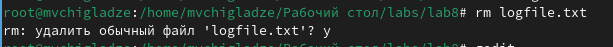

---
## Front matter
title: "Отчет по лабораторной работе №8"
subtitle: "Поиск файлов. Перенаправление ввода-вывода. Просмотр запущенных процессов"
author: "Чигладзе Майя Владиславовна"

## Generic otions
lang: ru-RU
toc-title: "Содержание"

## Bibliography
bibliography: bib/cite.bib
csl: pandoc/csl/gost-r-7-0-5-2008-numeric.csl

## Pdf output format
toc: true # Table of contents
toc-depth: 2
lof: true # List of figures
lot: true # List of tables
fontsize: 12pt
linestretch: 1.5
papersize: a4
documentclass: scrreprt
## I18n polyglossia
polyglossia-lang:
  name: russian
  options:
    - spelling=modern
    - babelshorthands=true
polyglossia-otherlangs:
  name: english
## I18n babel
babel-lang: russian
babel-otherlangs: english
## Fonts
mainfont: PT Serif
romanfont: PT Serif
sansfont: PT Sans
monofont: PT Mono
mainfontoptions: Ligatures=TeX
romanfontoptions: Ligatures=TeX
sansfontoptions: Ligatures=TeX,Scale=MatchLowercase
monofontoptions: Scale=MatchLowercase,Scale=0.9
## Biblatex
biblatex: true
biblio-style: "gost-numeric"
biblatexoptions:
  - parentracker=true
  - backend=biber
  - hyperref=auto
  - language=auto
  - autolang=other*
  - citestyle=gost-numeric
## Pandoc-crossref LaTeX customization
figureTitle: "Рис."
tableTitle: "Таблица"
listingTitle: "Листинг"
lofTitle: "Список иллюстраций"
lotTitle: "Список таблиц"
lolTitle: "Листинги"
## Misc options
indent: true
header-includes:
  - \usepackage{indentfirst}
  - \usepackage{float} # keep figures where there are in the text
  - \floatplacement{figure}{H} # keep figures where there are in the text
---

# **Цель работы**

Ознакомление с инструментами поиска файлов и фильтрации текстовых данных.
Приобретение практических навыков: по управлению процессами (и заданиями), по
проверке использования диска и обслуживанию файловых систем.

# **Порядок выполнения лабораторной работы**

## Задание 1.  Выполнить все примеры, приведённые в первой части описания лабораторной работы.

1. Осуществила вход в систему, используя соответствующее имя пользователя.(рис. 1).

{#fig:001 width=70%}

2. Записала в файл file.txt названия файлов, содержащихся в каталоге /etc. Дописала в этот же файл названия файлов, содержащихся в моем домашнем каталоге. (рис. 2). Результат (рис. 3)

{#fig:002 width=70%}

{#fig:003 width=70%}

3. Вывела имена всех файлов из file.txt, имеющих расширение .conf, после чего записала их в новый текстовой файл conf.txt. (рис. 4). Результат (рис 5.).

{#fig:004 width=70%}

{#fig:005 width=70%}

4. Определила, какие файлы в моем домашнем каталоге имеют имена, начинавшиеся с символа c(рис. 6).? Еще можно было бы их записать в файл и найти командой grep.

{#fig:006 width=70%}

5. Вывела на экран (по странично) имена файлов из каталога /etc, начинающиеся с символа h (рис. 7).

{#fig:007 width=70%}

6. Запустила в фоновом режиме процесс, который будет записывать в файл ~/logfile файлы, имена которых начинаются с log (рис. 8).

{#fig:008 width=70%}

7. Удалила файл ~/logfile (рис. 9).

{#fig:009 width=70%}

8. Запустила из консоли в фоновом режиме редактор gedit(рис. 10).

{#fig:010 width=70%}

9. Определила идентификатор процесса gedit, используя команду ps, конвейер и фильтр grep. Как ещё можно определить идентификатор процесса?(рис. 11).

{#fig:011 width=70%}

10. Прочитала справку (man) команды kill, после чего использовала её для завершения процесса gedit (рис. 12).

{#fig:012 width=70%}

11. Выполнила команды df и du, предварительно получив более подробную информацию об этих командах, с помощью команды man (рис. 13).

{#fig:013 width=70%}

12. Воспользовавшись справкой команды find, вывела имена всех директорий, имеющихся в моем домашнем каталоге (рис. 14).

{#fig:014 width=70%}

# Ответы на контрольные вопросы

1. Потоки ввода-вывода - это способ обмена данными между программами или частями одной программы. Они включают в себя:
Стандартный поток ввода (stdin) - поток данных, получаемых программой от пользователя или другой программы.
Стандартный поток вывода (stdout) - поток данных, выдаваемых программой на экран или в другую программу.
Ошибка вывода (stderr) - используется для вывода сообщений об ошибках.

2. Операция ‘>’ перезаписывает содержимое файла, указанного в правой части оператора, новыми данными, поступающими из конвейера. Операция ‘>>’ добавляет данные в конец указанного файла, не удаляя его предыдущее содержимое.

3. Конвейер - это механизм, позволяющий передавать выходные данные одной команды на вход другой команды для последовательного выполнения операций.

4. Процесс - это экземпляр выполняемой программы, который имеет свой уникальный идентификатор (PID). Процесс может состоять из одного или нескольких потоков выполнения, которые выполняются параллельно.

5. PID (Process ID) - уникальный идентификатор процесса, используемый операционной системой для управления процессами. GID (Group ID) - идентификатор группы пользователей, к которой принадлежит процесс.

6. Команда ‘jobs’ позволяет управлять задачами, запущенными в текущем сеансе.Задачи можно приостанавливать, возобновлять, прерывать или удалять.

7. Утилиты ‘top’ и ‘htop’ предназначены для мониторинга процессов в системе. ‘top’ отображает список процессов и информацию о них в реальном времени, а ‘htop’ предоставляет более подробную информацию о процессах и позволяет управлять ими.

8. Команда поиска файлов ‘find’ используется для поиска файлов и каталогов по заданным критериям. Примеры использования:
find . -name “*.txt” - выводит все текстовые файлы в текущем каталоге и его подкаталогах.
find /usr/bin -name “vi” -print - выводит список всех исполняемых файлов vi в каталоге /usr/bin.

9. Да, можно найти файл по контексту с помощью команды ‘grep’. Например, команда ‘grep “hello” /etc/passwd’ ищет строку “hello” в файле /etc/passwd.

10. Для определения объема свободной памяти на жестком диске можно использовать команду ‘df -h’, которая выводит информацию о использовании дискового пространства.

11. Объем вашего домашнего каталога можно узнать с помощью команды ‘du -sh ~’, которая выводит размер текущего каталога (включая все подкаталоги).

# **Выводы** 

В ходе лабораторной работы, я ознакомилась с инструментами поиска файлов и фильтрации текстовых данных. Приобрела практические навыки: по управлению процессами (и заданиями), по проверке использования диска и обслуживанию файловых систем.

# Список литературы{.unnumbered}

::: {#refs}
:::

