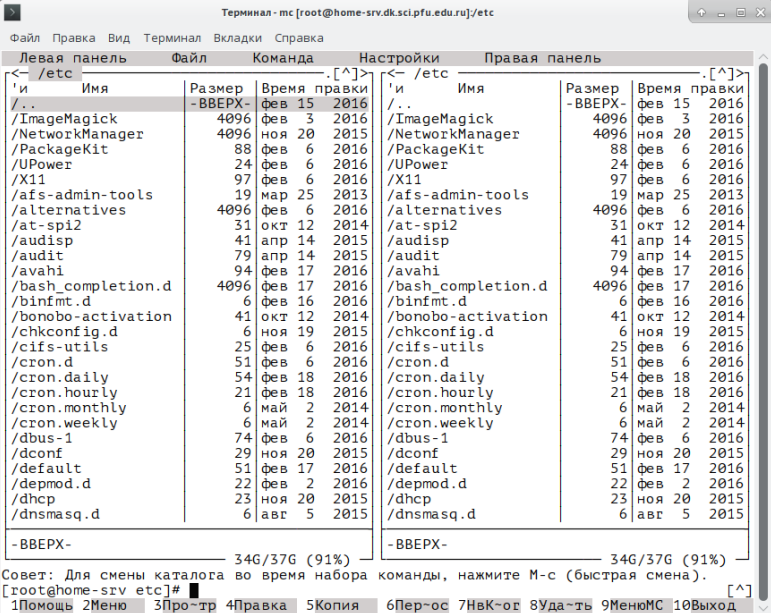
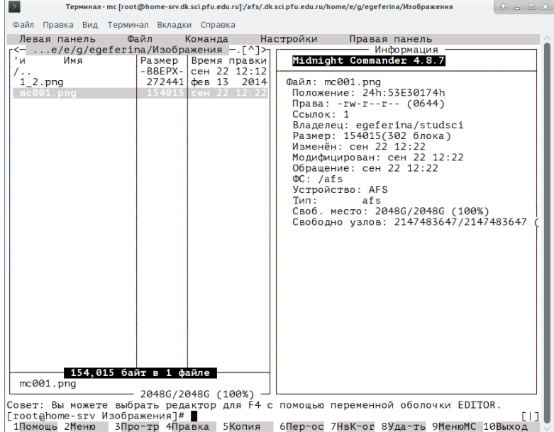
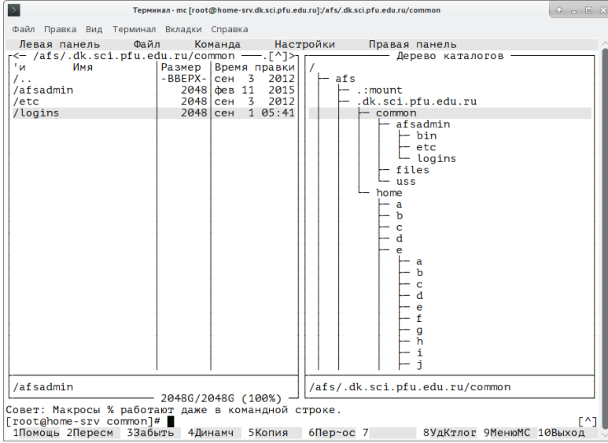
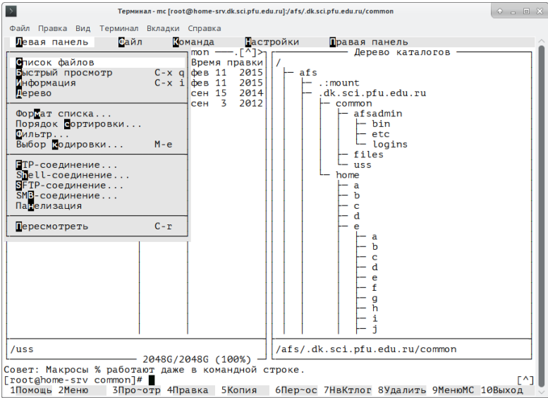
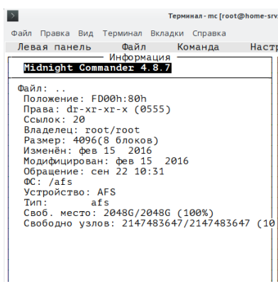
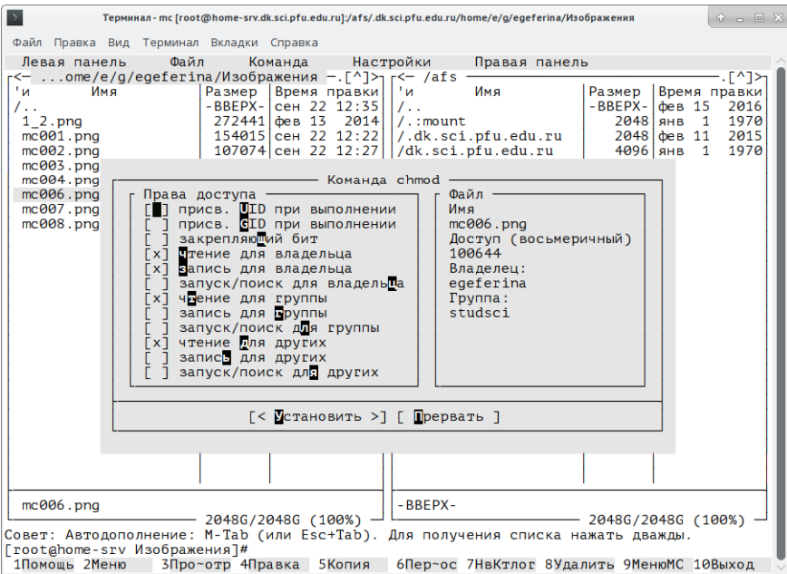
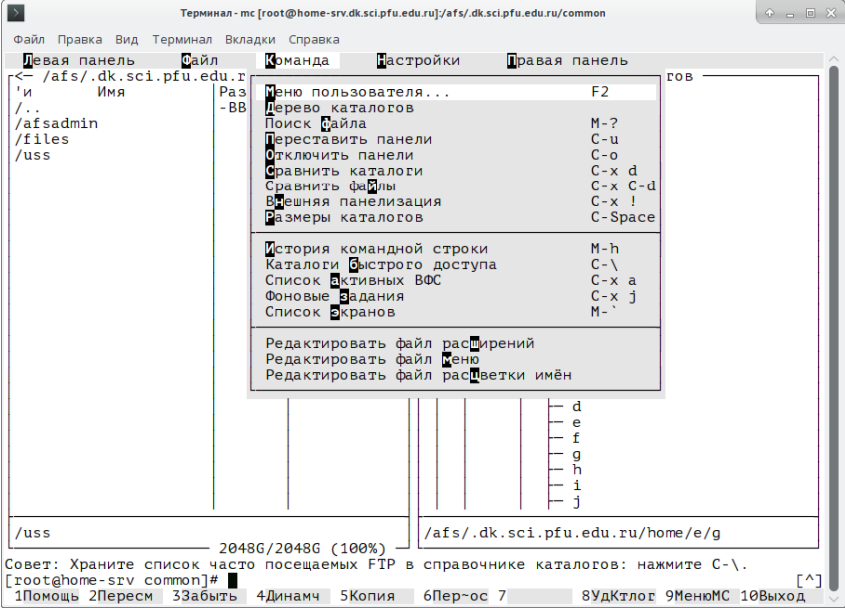
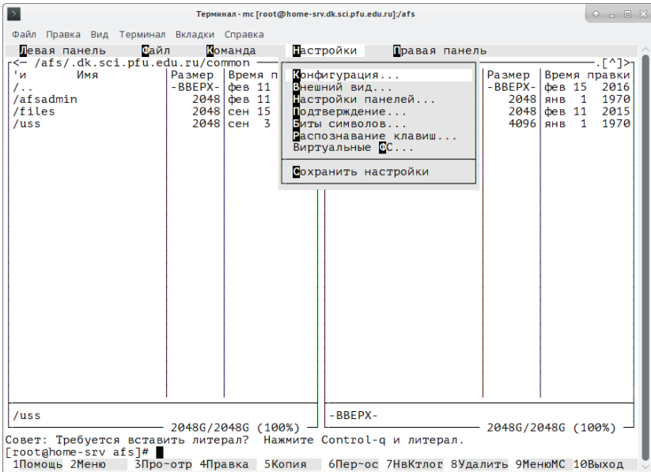

---
## Front matter
lang: ru-RU
title: Лабораторная работа 9
subtitle: Командная оболочка Midnight Commander
author:
  - Чигладзе М.В.
institute:
  - Российский университет дружбы народов, Москва, Россия
date: 29 мая 2003

## i18n babel
babel-lang: russian
babel-otherlangs: english

## Formatting pdf
toc: false
toc-title: Содержание
slide_level: 2
aspectratio: 169
section-titles: true
theme: metropolis
header-includes:
 - \metroset{progressbar=frametitle,sectionpage=progressbar,numbering=fraction}
 - '\makeatletter'
 - '\beamer@ignorenonframefalse'
 - '\makeatother'
 ## Fonts
mainfont: PT Serif
romanfont: PT Serif
sansfont: PT Sans
monofont: PT Mono
mainfontoptions: Ligatures=TeX
romanfontoptions: Ligatures=TeX
sansfontoptions: Ligatures=TeX,Scale=MatchLowercase
monofontoptions: Scale=MatchLowercase,Scale=0.9
---

# Информация

## Докладчик

:::::::::::::: {.columns align=center}
::: {.column width="70%"}

  * Чигладзе Майя Владиславовна
  * студентка РУДН направления Прикладная информатика
  * заместитель ОСК профсоюза РУДН
  * волонтер университета и Москвы
  * [1132239399@pfur.ru]
  * <https://github.com/LaMeru>

:::
::: {.column width="30%"}

:::
::::::::::::::

# Вводная часть

## Актуальность
 -  Лабораторная работа посвящена изучению командной оболочки Midnight Commander, которая является важным инструментом для работы с файловой системой в операционных системах семейства UNIX и Linux. Актуальность изучения данной темы заключается в том, что Midnight Commander позволяет эффективно управлять файлами и каталогами, а также обеспечивает доступ к командам системы. Знание данного инструмента позволит пользователям повысить свою эффективность при работе с операционной системой.

## Объект и предмет исследования
 - Объект исследования: Командная оболочка Midnight Commander
 - Предмет исследования: Функции и возможности командной оболочки Midnight Commander

## Цели и задачи
Цель работы: Освоение основных возможностей командной оболочки Midnight Commander. Приобретение навыков практической работы по просмотру каталогов и файлов; манипуляций
с ними
Задачи работы:
 - Изучить основные функции и возможности Midnight Commander
 - Освоить основные команды и операции с файлами и каталогами
 - Изучить возможности встроенного редактора Midnight Commander
 - Рассмотреть возможности работы с FTP и SSH в Midnight Commander
 - Получить практические навыки работы с командной оболочкой и использовать полученные знания в повседневной работе с UNIX и Linux системами.
 
## Материалы и методы

 - Изучение документации и справочной системы Midnight Commander
 - Тестирование функций и возможностей командной оболочки
 - Анализ полученных результатов и формулирование выводов
 - Цель исследования: Изучение функций и возможностей командной оболочки Midnight Commander и получение практических навыков работы с ней.
 
# Выполнение лабораторной работы

## Внешний вид экрана при работе с Midnight Commander

## Режим информация

## Режим отображения дерева каталогов

## Меню левая панель

## Панель информации

## Меню файл

## Права доступа на файлы и каталоги

## Меню команда

## Меню настройки

# Результаты

В результате данной работы я освоила основные возможности командной оболочки Midnight Commander. Приобрела навыки практической работы по просмотру каталогов и файлов; манипуляций с ними
