---
## Front matter
title: "Отчет по лабораторной работе №9"
subtitle: "Командная оболочка Midnight Commander"
author: "Чигладзе Майя Владиславовна"

## Generic otions
lang: ru-RU
toc-title: "Содержание"

## Bibliography
bibliography: bib/cite.bib
csl: pandoc/csl/gost-r-7-0-5-2008-numeric.csl

## Pdf output format
toc: true # Table of contents
toc-depth: 2
lof: true # List of figures
lot: true # List of tables
fontsize: 12pt
linestretch: 1.5
papersize: a4
documentclass: scrreprt
## I18n polyglossia
polyglossia-lang:
  name: russian
  options:
    - spelling=modern
    - babelshorthands=true
polyglossia-otherlangs:
  name: english
## I18n babel
babel-lang: russian
babel-otherlangs: english
## Fonts
mainfont: PT Serif
romanfont: PT Serif
sansfont: PT Sans
monofont: PT Mono
mainfontoptions: Ligatures=TeX
romanfontoptions: Ligatures=TeX
sansfontoptions: Ligatures=TeX,Scale=MatchLowercase
monofontoptions: Scale=MatchLowercase,Scale=0.9
## Biblatex
biblatex: true
biblio-style: "gost-numeric"
biblatexoptions:
  - parentracker=true
  - backend=biber
  - hyperref=auto
  - language=auto
  - autolang=other*
  - citestyle=gost-numeric
## Pandoc-crossref LaTeX customization
figureTitle: "Рис."
tableTitle: "Таблица"
listingTitle: "Листинг"
lofTitle: "Список иллюстраций"
lotTitle: "Список таблиц"
lolTitle: "Листинги"
## Misc options
indent: true
header-includes:
  - \usepackage{indentfirst}
  - \usepackage{float} # keep figures where there are in the text
  - \floatplacement{figure}{H} # keep figures where there are in the text
---

# **Цель работы**

Освоение основных возможностей командной оболочки Midnight Commander. Приобретение навыков практической работы по просмотру каталогов и файлов; манипуляций
с ними.

# **Порядок выполнения лабораторной работы**

## Задание 1.  Задания по mc

1. Изучила информацию о mc, вызвав в командной строке man mc.(рис. 1).

{#fig:001 width=70%}

2. Запустила из командной строки mc, изучила его структуру и меню (рис. 2).

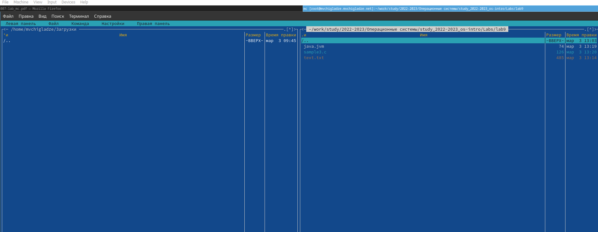{#fig:002 width=70%}

3. Выполнила несколько операций в mc, используя управляющие клавиши (операции с панелями; выделение/отмена выделения файлов, копирование/перемещение файлов, получение информации о размере и правах доступа на файлы и/или каталоги и т.п.) (рис. 3 и 4 ).

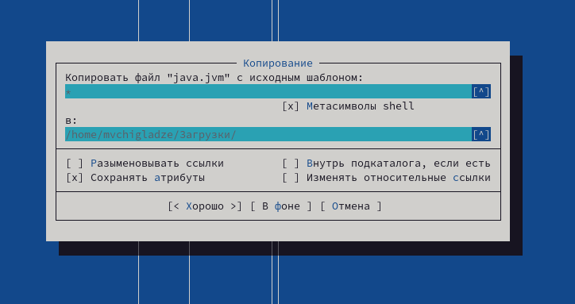{#fig:003 width=70%}

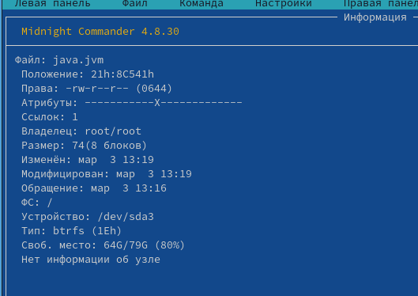{#fig:004 width=70%}

4. Выполнила основные команды меню левой (или правой) панели. Оценила степень подробности вывода информации о файлах. (рис. 5 и 6 ).

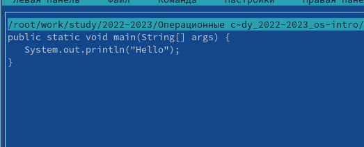{#fig:005 width=70%}

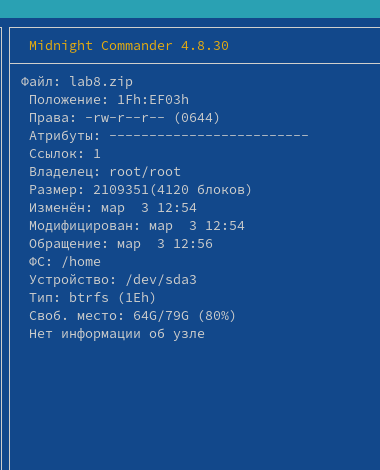{#fig:006 width=70%}

5. Используя возможности подменю Файл , выполнила:
– просмотр содержимого текстового файла; (рис. 7).

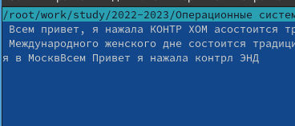{#fig:007 width=70%}

– редактирование содержимого текстового файла (без сохранения результатов
редактирования);(рис. 8).

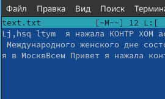{#fig:008 width=70%}

– создание каталога(рис. 9).

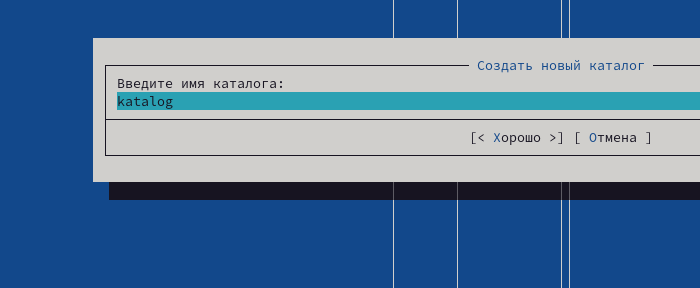{#fig:009 width=70%}

– копирование в файлов в созданный каталог(рис. 10).

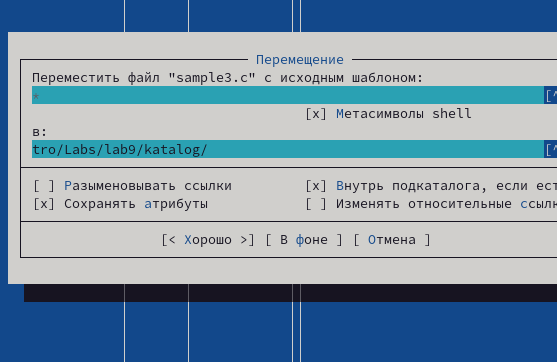{#fig:010 width=70%}

6. С помощью соответствующих средств подменю Команда осуществила:

– поиск в файловой системе файла с заданными условиями (например, файла
с расширением .c или .cpp, содержащего строку main);(рис. 11 и 12 ).

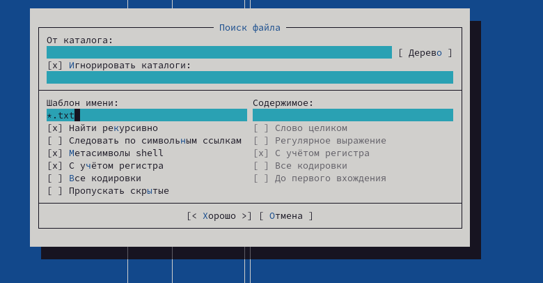{#fig:011 width=70%}

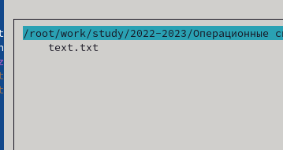{#fig:0012 width=70%}

– выбор и повторение одной из предыдущих команд (рис. 13).

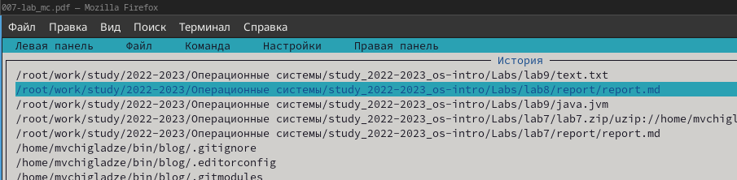{#fig:013 width=70%}

– переход в домашний каталог (рис. 14).

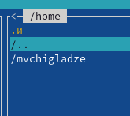{#fig:014 width=70%}

7. Вызвала подменю Настройки . Освоила операции, определяющие структуру экрана mc
(Full screen, Double Width, Show Hidden Files и т.д.)(рис. 15).

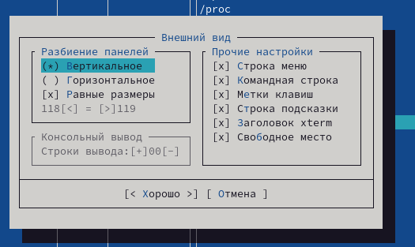{#fig:015 width=70%}

## Задание 2.  Задание по встроенному редактору mc

1. ​Создайте текстовой файл text.txt (рис. 16).

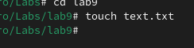{#fig:016 width=70%}

2. Откройте этот файл с помощью встроенного в mc редактора (рис. 17).

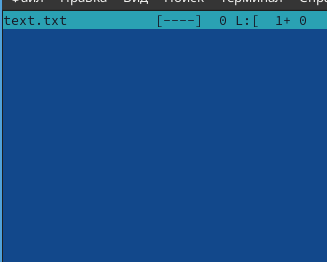{#fig:017 width=70%}

3. Вставьте в открытый файл небольшой фрагмент текста, скопированный из любого
другого файла или Интернета (рис. 18).

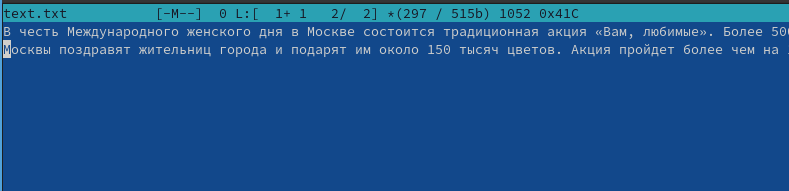{#fig:018 width=70%}

4. Проделайте с текстом следующие манипуляции, используя горячие клавиши 

4.1. Удалите строку текста (рис. 19).

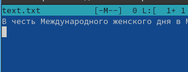{#fig:019 width=70%}

4.2. Выделите фрагмент текста и скопируйте его на новую строку (рис. 20 и 21).

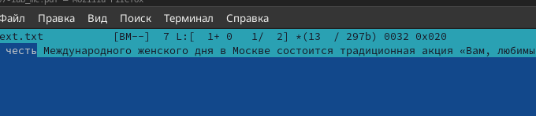{#fig:020 width=70%}

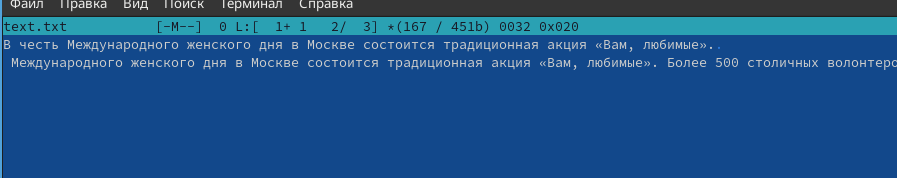{#fig:021 width=70%}

4.3. Выделите фрагмент текста и перенесите его на новую строку (рис. 22).

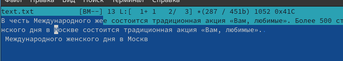{#fig:022 width=70%}

4.4. Сохраните файл (рис. 23).

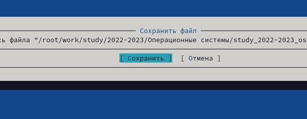{#fig:023 width=70%}

4.5. Отмените последнее действие (рис. 24).

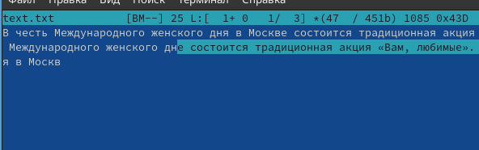{#fig:024 width=70%}

4.6. Перейдите в конец файла (нажав комбинацию клавиш) и напишите некоторый
текст (рис. 25).

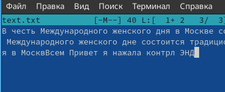{#fig:025 width=70%}

4.7. Перейдите в начало файла (нажав комбинацию клавиш) и напишите некоторый
текст (рис. 26).

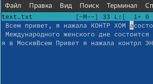{#fig:026 width=70%}

4.8. Сохраните и закройте файл (рис. 27).

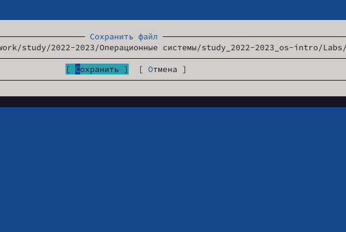{#fig:027 width=70%}

5. Откройте файл с исходным текстом на некотором языке программирования (напри-
мер C или Java) (рис. 28).

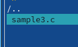{#fig:028 width=70%}

6. Используя меню редактора, включите подсветку синтаксиса, если она не включена,
или выключите, если она включена (рис. 29).

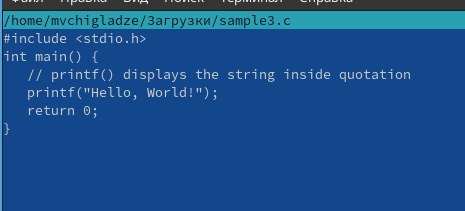{#fig:029 width=70%}

# Ответы на контрольные вопросы 

1. Режимы работы в mc: a) Режим просмотра файлов: основной режим работы, в котором отображается содержимое текущей директории. b) Режим редактирования файла: позволяет редактировать содержимое файла с помощью встроенного текстового редактора. c) Режим копирования файлов: предназначен для копирования файлов между директориями. d) Режим удаления файлов: позволяет удалить файлы и директории.

2. Операции с файлами, которые можно выполнить как с помощью команд оболочки (shell), так и с помощью меню (комбинации клавиш) в mc: a) Копирование файла: можно выполнить с помощью команды cp или через меню Команды -> Копировать в. b) Переименование файла: можно выполнить с помощью команды mv или через меню Файлы -> Переименовать. c) Удаление файла: можно выполнить с помощью команды rm или через меню Файл -> Удалить.

3. Структура меню левой (или правой) панели в mc: Меню левой панели содержит следующие команды: a) Просмотр файла: открывает файл в текстовом редакторе. b) Редактирование файла: позволяет отредактировать файл. c) Копирование файлов: копирует файлы между директориями. d) Удаление файлов: удаляет файлы или директории. e) Создание директории: создает новую директорию.

4. Меню Файл в mc содержит команды для работы с файлами:
a) Просмотр файла - открывает файл в редакторе;
b) Редактирование файла - позволяет отредактировать файл;
c) Копирование - копирует файл в другую директорию;
d) Переименование - изменяет имя файла;
e) Удаление - удаляет файл из директории;
f) Создание директории - создает новую директорию в текущей директории;
g) Выход - закрывает Midnight Commander.

5. Меню Команда в mc содержит следующие команды для управления файлами:
a) Копировать в… - копирует выделенные файлы в указанную директорию;
b) Переместить в… - перемещает выделенные файлы в указанную директорию;
c) Сравнить по содержимому - сравнивает два выделенных файла;
d) Выделить все - выделяет все файлы в текущей директории;
e) Снять выделение со всех - снимает выделение со всех файлов;
f) Поиск - ищет файлы по имени или содержимому;
g) Обновить - обновляет содержимое директории.

6. Меню “Настройки” в mc имеет следующую структуру:
a. Общие настройки - настройка внешнего вида Midnight Commander (язык интерфейса, цвета, шрифты и т.д.).
b. Настройки горячих клавиш - назначение пользовательских комбинаций клавиш для выполнения различных операций.
c. Настройки FTP - настройка подключения к FTP-серверам.
d. Настройки SSH - настройка подключения к SSH-серверам.
e. Настройки Samba - настройка подключения к Samba-серверам.
f. Настройки SMB - настройка подключения к SMB-серверам (Windows share).
g. Настройки LAN - настройка работы с локальными сетями.
h. Настройки VFS - настройка виртуальных файловых систем (zip, tar, lzma и т.д.)
i. Настройки MIME - настройка ассоциации типов файлов с программами для их открытия.
j. Настройки автомонтирования - настройка автоматического монтирования CD/DVD дисков и USB-устройств.

7. Midnight Commander имеет множество встроенных команд, которые выполняются через меню или с использованием горячих клавиш. Некоторые из них:
Просмотр файла – открывает файл в режиме просмотра.
Редактирование файла – позволяет редактировать файл.
Копирование файла – копирует файл.
Переименование файла – позволяет изменить имя файла.
Удаление файла – удаляет файл.
Создание директории – создает новую директорию.
Обновление списка файлов – обновляет список файлов в текущей директории.
Поиск файла – выполняет поиск файла по имени.
Выделение файлов – выделяет файлы для выполнения групповых операций.
Встроенный редактор Midnight Commander предоставляет пользователю возможность редактировать текстовые файлы. Команды встроенного редактора:
Создать новый файл – создает новый пустой файл.
Открыть файл для редактирования – открывает существующий файл для редактирования.
Сохранить изменения в файле – сохраняет изменения, внесенные в файл.
Средства Midnight Commander для создания определяемых пользователем меню позволяют пользователям создавать свои собственные меню и добавлять в них необходимые команды. Средства для выполнения действий над текущим файлом включают в себя различные операции копирования, перемещения, удаления и т. д.

8. Midnight Commander поставляется со встроенным редактором, который позволяет пользователям редактировать текстовые файлы прямо из интерфейса файлового менеджера. Команды встроенного редактора включают:
Создать новый файл
Открыть файл для редактирования
Сохранить изменения в файле

9. Midnight Commander предлагает пользователям возможность создавать свои собственные меню для выполнения определенных задач. Это позволяет пользователям настроить файловый менеджер по своему вкусу.

10. Midnight Commander предоставляет пользователям широкий спектр средств для выполнения различных действий над текущими файлами. Эти действия включают копирование, перемещение, переименование, удаление и т. Д.

# **Выводы** 

В ходе лабораторной работы, я освоила основные возможности командной оболочки Midnight Commander. Приобрела навыки практической работы по просмотру каталогов и файлов; манипуляций с ними.

# Список литературы{.unnumbered}

::: {#refs}
:::

