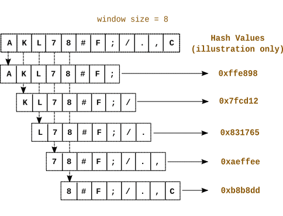
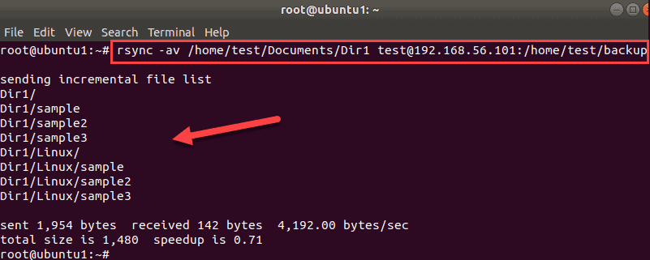

---
## Front matter
lang: ru-RU
title: Доклад на тему
subtitle: Использование rsync для резервного копирования данных.
author:
  - Чигладзе М.В.
institute:
  - Российский университет дружбы народов, Москва, Россия
date: 29 мая 2003

## i18n babel
babel-lang: russian
babel-otherlangs: english

## Formatting pdf
toc: false
toc-title: Содержание
slide_level: 2
aspectratio: 169
section-titles: true
theme: metropolis
header-includes:
 - \metroset{progressbar=frametitle,sectionpage=progressbar,numbering=fraction}
 - '\makeatletter'
 - '\beamer@ignorenonframefalse'
 - '\makeatother'
 ## Fonts
mainfont: PT Serif
romanfont: PT Serif
sansfont: PT Sans
monofont: PT Mono
mainfontoptions: Ligatures=TeX
romanfontoptions: Ligatures=TeX
sansfontoptions: Ligatures=TeX,Scale=MatchLowercase
monofontoptions: Scale=MatchLowercase,Scale=0.9
---

# Информация


## Докладчик

:::::::::::::: {.columns align=center}
::: {.column width="70%"}

  * Чигладзе Майя Владиславовна
  * студентка РУДН направления Прикладная информатика
  * заместитель ОСК профсоюза РУДН
  * волонтер университета и Москвы
  * [1132239399@pfur.ru]
  * <https://github.com/LaMeru>

:::
::: {.column width="30%"}


:::
::::::::::::::

# Вводная часть


## Актуальность
Использование rsync является актуальным и эффективным способом для резервного копирования данных, особенно при работе с большими объемами информации или при необходимости синхронизации файлов между удаленными системами. Rsync позволяет копировать только измененные блоки файлов, что значительно снижает затраты на передачу данных и ускоряет процесс резервного копирования. 

{#fig:001 width=30%}

## Объект и предмет исследования

 - Объект исследования: Процесс резервного копирования данных с использованием rsync
 
 - Предмет исследования: Эффективность и актуальность использования rsync для резервного копирования, а также его возможности и ограничения.
 
{#fig:002 width=30%}

## Научная новизна

Научная новизна данного доклада заключается в исследовании эффективности и актуальности использования rsync для резервного копирования данных в современных условиях, а также в анализе возможностей и ограничений данного инструмента.

{#fig:003 width=40%}

## Практическая значимость работы

Практическая значимость данной работы заключается в возможности использования полученных результатов для оптимизации процессов резервного копирования данных с помощью rsync, что позволит повысить эффективность работы с информацией и обеспечить надежность хранения данных.

{#fig:004 width=30%}

## Цель, гипотеза, задачи

- Цель: Исследовать эффективность и актуальность использования rsync для резервного копирования данных.

- Гипотеза: Использование rsync повышает эффективность резервного копирования данных и обеспечивает надежность их хранения.

- Задачи:
1. Изучить возможности и ограничения использования rsync для резервного копирования данных.
2. Исследовать влияние использования rsync на надежность хранения данных. 
3. Разработать рекомендации по использованию rsync для оптимального резервного копирования данных.
 
# Глава 1. Теоретическая часть

## Резервное копирование данных

Резервное копирование данных - важная часть как индивидуальной, так и корпоративной инфраструктуры. Машины с операционной системой Linux могут использовать rsync и ssh для облегчения процесса.

Rsync - это утилита командной строки, которая позволяет передавать файлы в локальные и удаленные места. Rsync удобен в использовании, поскольку он по умолчанию входит в состав большинства дистрибутивов Linux. Вы можете настроить инструмент, используя многие из доступных опций.

{#fig:005 width=20%}

## Автор

Rsync — инструмент для быстрой синхронизации файлов и каталогов с минимальным трафиком, который пришёл на замену rcp и scp. В нём используется алгоритм со скользящим хешем, разработанный австралийским учёным, программистом и хакером Эндрю Триджеллом по кличке Тридж 

{#fig:006 width=40%}

## Принцип работы

{#fig:007 width=55%}

# Глава 2. Как использовать rsync для резервного копирования данных

## Базовый синтаксис Rsync для локальной и внешней передачи

Синтаксис использования инструмента rsync отличается для локальной и удаленной передачи.
```code
rsync options SOURCE DESTINATION
```
```code
rsync options SOURCE user@IP_or_hostname:DESTINATION
```

## Ремарки

Для лучшего понимания того, что делает rsync, буду использовать подробный ключ -v. Кроме того, поскольку я буду создавать резервные копии данных в каталогах, то буду использовать режим архива -a для рекурсивной синхронизации. 

{#fig:008 width=45%}

## Меры предосторожности

Утилита rsync позволяет вам по-разному манипулировать вашими данными. Так что будьте осторожны при резервном копировании файлов. Если вы используете неправильный вариант или неправильный пункт назначения, вы можете смешать свои данные. Хуже того, вы можете случайно перезаписать или удалить файлы.

По этой причине используйте параметр --dry-run, чтобы убедиться, что инструмент делает то, что вы хотите. Для простых передач вам может не понадобиться использовать --dry-run, но когда речь идет о большем наборе данных рекомендуется это сделать.

```code
rsync options --dry-run SOURCE DESTINATION
```

## Rsync для локального резервного копирования данных

Начнем с резервного копирования каталога на той же машине Linux. Путь может быть любым - другой раздел, жесткий диск, внешнее хранилище и так далее.

Например, чтобы создать резервную копию Dir1 из документов в /media/hdd2/rscync_backup, используйте команду rsync в этой форме:

```code
rsync -av /home/test/Documents/Dir1 /media/hdd2/rsync_backup
```

{#fig:009 width=35%}

## Rsync для резервного копирования данных по сети

Для безопасного резервного копирования данных по сети rsync использует SSH для передачи. Ваш сервер должен быть настроен на разрешение SSH-соединения.

Например, чтобы создать резервную копию Dir1 для резервного копирования на другой машине по сети, введите:
```code
rsync -av /home/test/Documents/Dir1 test@192.168.56.101:/home/test/backup
```

{#fig:010 width=35%}

## Сжать данные при резервном копировании с помощью Rsync

1. Чтобы сжать данные во время передачи, используйте параметр -z с командой rsync.
```code
rsync -avz /home/test/Documents/Dir1 test@192.168.56.101:/home/test/backup
```

2. Другой вариант - использовать команду zip, чтобы заархивировать ваши файлы или каталог, а затем запустить rsync. В нашем случае мы заархивируем Dir1 в Dir.zip:
```code
zip /home/test/Documents/Dir1.zip /home/test/Documents/Dir1
```

Затем перенесите этот файл в другое место:
```code
rsync -avz /home/test/Documents/Dir1.zip test@192.168.56.101:/home/test/backup
```


# Результаты

В заключении можно сказать, что использование rsync для резервного копирования данных является актуальным и эффективным решением. 

{#fig:011 width=55%}
